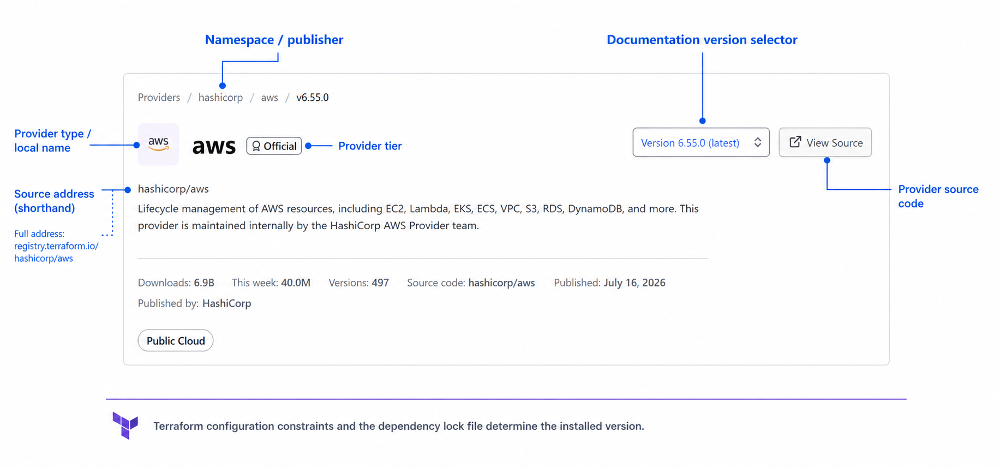

# Terraform Core Concepts and Commands Wiki

## Table of Contents

### Foundations and Configuration

- [How Terraform Works: A First Run](#how-terraform-works-a-first-run)
- [Core CLI Commands](#core-cli-commands)
- [Providers](#providers)
- [Terraform Settings Block](#terraform-settings-block-terraform-)
- [Terraform Versioning](#terraform-versioning)
- [Dependency Lock File](#dependency-lock-file-terraformlockhcl)
- [Multiple Provider Configurations](#multiple-provider-configurations)
- [Common Project Layout and Comments](#common-project-layout-and-comments)
- [Resource Blocks and References](#resource-blocks-and-references)
- [Configuration, State, and Remote Objects](#configuration-state-and-remote-objects)

### Values, Types, and Expressions

- [Data Types](#data-types)
- [Complex Data Types](#complex-data-types-object-and-set)
- [Variables and Output Values](#variables-and-output-values)
- [String Templates and Interpolation](#string-templates-and-interpolation)
- [Input Variable Validation](#input-variable-validation)
- [Local Values](#local-values-locals)
- [Data Sources](#data-sources-data-blocks)
- [Sensitive Input Variables and Outputs](#sensitive-input-variables-and-outputs)
- [Essential Terraform Functions and Expressions](#essential-terraform-functions-and-expressions)

### Repetition and Dynamic Configuration

- [The `count` Meta-Argument](#the-count-meta-argument)
- [`for_each` vs. `count`](#advanced-looping-for_each-vs-count)
- [Splat Expressions](#splat-expressions-)
- [Dynamic Blocks](#dynamic-blocks)

### Resource Lifecycle and Validation

- [Resource Dependencies](#resource-dependencies)
- [The `lifecycle` Meta-Argument](#the-lifecycle-meta-argument)
- [Custom Conditions](#custom-conditions-precondition--postcondition)
- [Check Blocks and Continuous Validation](#check-blocks-and-continuous-validation)
- [Provisioners](#provisioners-the-last-resort)

### Plans, Operations, and Troubleshooting

- [Saving and Inspecting Execution Plans](#saving-and-inspecting-execution-plans)
- [Querying Outputs](#querying-outputs)
- [Resource Targeting](#resource-targeting--target)
- [Resource Replacement and Dependency Visualization](#resource-replacement-and-dependency-visualization)
- [Terraform Logging and Debugging](#terraform-logging--debugging-tf_log)
- [API Throttling and Performance](#performance-optimization-api-throttling)

### Modules and Collaboration

- [Terraform Modules](#terraform-modules)
- [Git for Team Collaboration](#git-for-team-collaboration-with-terraform)

### Configuration and Secrets Security

- [Terraform Security Primer](#terraform-security-primer)
- [Terraform and `.gitignore`](#terraform-and-gitignore)
- [Security Risks of State in Git](#security-risk-of-storing-terraform-state-in-git)
- [Ephemeral Values and Write-Only Arguments](#ephemeral-values-and-write-only-arguments)

### State Storage and Coordination

- [Terraform Backend](#terraform-backend)
- [State Locking](#state-locking)
- [S3 Backend](#s3-backend)

### State Operations and Refactoring

- [Terraform Workspaces](#terraform-workspaces-environment-management)
- [Terraform State Management Commands](#terraform-state-management-commands)
- [State Refactoring with `moved` Blocks](#state-refactoring-moved-blocks)
- [Terraform Import](#terraform-import)
- [Removed Blocks](#removed-blocks)
- [Cross-Project Collaboration with Remote State](#cross-project-collaboration-using-remote-state-data-source)

### Vault and Terraform Platforms

- [HashiCorp Vault Basics](#hashicorp-vault-basics-and-why-vault-matters)
- [Terraform and Vault Integration](#terraform-and-vault-integration)
- [HCP Terraform and Terraform Enterprise](#hashicorp-cloud-platform-hcp-terraform-and-terraform-enterprise)

### Practical Exercises

- [Terraform Infrastructure Labs](#terraform-infrastructure-labs-master-index)

---

## How Terraform Works: A First Run

Terraform is a **declarative** infrastructure-as-code tool. You describe the result you want in `.tf` configuration files rather than writing every API operation required to produce that result. Terraform then determines which actions are necessary to make the managed objects match the configuration.

The initial workflow is:

```text
Write configuration → terraform init → terraform plan → terraform apply
     desired state        prepare          preview            execute
```

After initialization, the everyday cycle is usually:

```text
Edit configuration → terraform plan → terraform apply
```

Run `terraform init` again when initialization is required, such as after changing provider requirements, module sources, or backend configuration.

### A Small Local Example

The following configuration uses the `hashicorp/local` provider to create a text file. It runs entirely on your computer, so it does not require a cloud account or credentials.

Create a `.tf` file containing:

```hcl
terraform {
  required_providers {
    local = {
      source  = "hashicorp/local"
      version = "~> 2.0"
    }
  }
}

resource "local_file" "hello" {
  filename = "hello.txt"
  content  = "Hello from Terraform!"
}
```

This configuration declares the **desired state**: a file named `hello.txt` with specific content. It does not contain procedural instructions such as “open a file, write a line, and close it.”

### Prepare the Working Directory

```bash
terraform init
```

Terraform reads the provider requirement and installs `hashicorp/local`. It also creates or updates:

* **`.terraform/`**: Local working data, including installed providers and modules. Do not commit this directory.
* **`.terraform.lock.hcl`**: The exact provider selection and checksums used to verify the downloaded package. Normally commit this file.

Initialization prepares Terraform, but it does not create `hello.txt`.

### Preview the Proposed Changes

```bash
terraform plan
```

Terraform reads the configuration, examines the available state and managed objects, and calculates the actions required to reach the desired state. The first plan should report that one `local_file` resource will be added.

A plan is a preview. A normal `terraform plan` does not execute the proposed resource changes.

### Apply the Changes

```bash
terraform apply
```

When executed without a saved plan, `terraform apply` creates a new plan, asks for approval, and then asks the provider to perform the approved operations. In this example, the local provider creates `hello.txt`. When using the default local backend, Terraform also creates or updates `terraform.tfstate` to associate `local_file.hello` with the file it now manages.

Now change the desired content:

```hcl
content = "Terraform updated this file!"
```

The next `terraform plan` detects the difference and proposes the required change. After approval, `terraform apply` performs it and records the resulting state. This is the central Terraform workflow: declare the desired result, review Terraform's proposed reconciliation, and apply it.

### Clean Up the Example

When you finish the exercise, preview and remove the object managed by this configuration:

```bash
terraform destroy
```

`terraform destroy` creates a destruction plan and asks for approval. After approval, the local provider deletes `hello.txt`, and Terraform records in state that the resource is no longer managed.

The following sections explain each part of this workflow in more detail, beginning with the core commands and then the providers, lock file, configuration, and state that make the workflow possible.

---

## Core CLI Commands

* **`terraform init`**: Prepares a Terraform working directory. It initializes the backend and installs the required providers and modules in the hidden `.terraform` directory. Modules are covered in [Terraform Modules](#terraform-modules).
  * **`terraform init -upgrade`**: Reconsiders provider and module selections and chooses the newest versions allowed by the configured constraints. For providers, it updates `.terraform.lock.hcl`; review the lock-file diff and the next plan before committing an upgrade. See [Dependency Lock File](#dependency-lock-file-terraformlockhcl).
* **`terraform validate`**: Checks the configuration for syntax errors and internal consistency without accessing remote state or provider APIs. It requires an initialized working directory; use `terraform init -backend=false` first when you want validation without initializing the configured backend.
* **`terraform fmt`**: Automatically formats your Terraform configuration files into a canonical style and standard indentation.
* **`terraform plan`**: Refreshes resource information by default, compares the configuration with state, and proposes actions. A normal plan does not make the proposed infrastructure changes.
* **`terraform apply`**: Creates a new plan and asks for approval, or executes a previously saved plan. Providers then create, update, or delete objects to move infrastructure toward the configured state.
* **`terraform destroy`**: Creates and applies a special plan that destroys all managed objects associated with the current Terraform configuration and state.
* **`terraform output`**: Displays root-module output values from the latest state snapshot. Use `terraform output <name>` for one value or `terraform output -json` for machine-readable results. Output querying is covered in detail in [Querying Outputs](#querying-outputs).
* **`terraform destroy -target`**: Focuses the destroy operation on a particular resource address. Terraform may also include dependencies, so always review the generated plan carefully.
    * *Syntax:* `<resource_type>.<local_name>`
    * *Example:* `terraform destroy -target=aws_instance.myec2`

Resource addresses are introduced in [Resource Blocks and References](#resource-blocks-and-references), state in [Configuration, State, and Remote Objects](#configuration-state-and-remote-objects), and backends in [Terraform Backend](#terraform-backend).

> **Note on Removing Resources via Code:** If you delete a resource block and apply the resulting plan, Terraform normally destroys the remote object that is still recorded in state. If Terraform must stop managing an object without destroying it, use a `removed` block with `destroy = false`, explained in [Removed Blocks](#removed-blocks).

> **Note on `terraform refresh` (Deprecated):**
> * Its original purpose was to query the cloud provider and update the `terraform.tfstate` file to match the real-world status.
> * Nowadays, when you run `terraform plan` or `terraform apply`, Terraform automatically performs a refresh in the background before calculating changes.
> * To review and record out-of-band changes without changing remote objects, use `terraform plan -refresh-only` followed by `terraform apply -refresh-only`. Local state normally has a `terraform.tfstate.backup`; remote backends use their own storage and versioning behavior.

---

## Providers

A provider is a plugin that lets Terraform interact with an external API.

### Terraform Registry and Provider Source Addresses

The public [Terraform Registry provider directory](https://registry.terraform.io/browse/providers) is the main catalog for publicly available providers and their versioned documentation. A provider source address identifies where Terraform should obtain a provider and has this format:

```text
[hostname/]namespace/type
```

For example, `hashicorp/aws` is shorthand for the complete source address `registry.terraform.io/hashicorp/aws`:

| Address part | Example | Purpose |
| :--- | :--- | :--- |
| **Hostname** | `registry.terraform.io` | Registry that distributes the provider. Terraform assumes the public Registry when this part is omitted. |
| **Namespace** | `hashicorp` | Organization or publisher responsible for the provider. |
| **Type** | `aws` | Provider's name; it normally also becomes the local name used by the module. |

Organizations are not limited to the public Registry. A source such as `terraform.example.com/examplecorp/ourcloud` can refer to a provider in a private or internal registry. Terraform can also be configured to install providers through filesystem or network mirrors. See HashiCorp's [provider requirements](https://developer.hashicorp.com/terraform/language/providers/requirements) and [provider installation](https://developer.hashicorp.com/terraform/cli/config/config-file#provider-installation) documentation.

During `terraform init`, Terraform reads the provider requirements from the configuration, considers the selected versions in `.terraform.lock.hcl`, and installs the required provider plugins from the configured registry, mirror, or cache. The version displayed on a Registry documentation page is not necessarily the version installed in a project; the configuration's version constraints and the dependency lock file control that selection.

> **Exam Tip — Provider Installation Path:** For a normally initialized working directory, Terraform stores installed provider packages under `.terraform/providers`, organized by source address, version, and target platform. An AWS provider path looks similar to `.terraform/providers/registry.terraform.io/hashicorp/aws/<VERSION>/<OS_ARCH>/`. Terraform manages this directory automatically; do not edit or commit it. A configured shared plugin cache or a custom Terraform data directory can change where the underlying files are stored.



### Declaring and Configuring a Provider

Provider **requirements** and provider **configurations** have different purposes:

* **`required_providers`** declares the provider's local name, source address, and acceptable versions.
* **`provider`** configures an instance of that provider with settings such as a region, endpoint, or authentication behavior.

An explicit `required_providers` declaration is the recommended practice for every external provider, but Terraform can sometimes operate without one. If Terraform encounters the local provider name `aws` without an explicit source address, it uses the implied address `registry.terraform.io/hashicorp/aws`. This inference exists for backward compatibility and should not be relied on in modern configurations: it assumes the `hashicorp` namespace, cannot identify a community or private provider, and does not document an intentional version constraint.

The `provider` block is also not always required. Terraform can use an implied empty default configuration when a provider needs no explicit settings or can obtain them from external sources. In the following AWS example, the block is present because it explicitly sets the region:

```hcl
terraform {
  required_providers {
    aws = {
      source  = "hashicorp/aws"
      version = "~> 6.0"
    }
  }
}

provider "aws" {
  region = "us-east-1"
}

resource "aws_s3_bucket" "example" {
  bucket_prefix = "provider-example-"
}
```

In this example, `required_providers` explicitly tells Terraform to install `hashicorp/aws` at a version allowed by `~> 6.0`, while `provider "aws"` configures its AWS region. The `aws_` prefix in `aws_s3_bucket` associates that resource type with the local provider name `aws`.

### Provider Tiers

| Type | Description |
| :--- | :--- |
| **Official** | Owned and maintained by HashiCorp. |
| **Partner / Partner Premier** | Written and maintained by a third-party technology partner and approved through HashiCorp's partner program. |
| **Community** | Owned and maintained by individual contributors. |
| **Archived** | An Official or Partner provider that is no longer maintained. |

The syntax and other uses of `required_providers` are covered in [Terraform Settings Block](#terraform-settings-block-terraform-).

### AWS Provider Source Credentials

When authenticating the AWS provider, you have several options:

* **Environment Variables (Recommended for CI/CD):** Exporting `AWS_ACCESS_KEY_ID` and `AWS_SECRET_ACCESS_KEY` in your terminal session.
* **Shared Config File (Recommended for Local Dev):** Configuring credentials via the **AWS CLI** (`aws configure`). Terraform will default to the standard `$HOME/.aws/` directory.
* **Hardcoding in configuration:** Do not place access keys directly in `.tf` files or commit them to version control.

---

## Terraform Settings Block (`terraform {}`)

The `terraform` block configures Terraform itself rather than a remote infrastructure object.

This section introduces its two most common settings. The `terraform` block supports additional options that are covered later where they become relevant.

* **`required_version`**: Defines the Terraform CLI version or range of versions allowed to execute the configuration (e.g., `required_version = ">= 1.5.0"`).
* **`required_providers`**: Declares provider local names, source addresses, and allowed version constraints.

> **Important:** The `terraform` block accepts only constant values. Its arguments cannot reference input variables, local values, resources, data sources, or other named values, and they cannot call Terraform functions. Terraform must evaluate these settings before it can process the rest of the configuration.

```hcl
terraform {
  required_version = "~> 1.5.0"
  required_providers {
    aws = {
      source  = "hashicorp/aws"
      version = "~> 5.0"
    }
  }
}
```

---

## Terraform Versioning

Terraform CLI and provider plugins are separate software components with independent versions. Version constraints help a team use versions that are compatible with the configuration.

### Provider Version Constraints

Provider constraints belong inside `required_providers`. They tell Terraform which provider releases are acceptable; `.terraform.lock.hcl` records the exact version currently selected from that allowed range.

```hcl
terraform {
  required_providers {
    aws = {
      source  = "hashicorp/aws"
      version = "~> 6.0"
    }
  }
}
```

Common constraint forms include:

| Constraint | Meaning | Examples allowed | Examples rejected |
| :--- | :--- | :--- | :--- |
| `= 6.2.0` or `6.2.0` | Exactly one version | `6.2.0` | `6.2.1`, `6.3.0` |
| `>= 6.2.0` | The specified version or any newer version | `6.2.0`, `7.0.0` | `6.1.0` |
| `>= 6.2.0, < 7.0.0` | Every comma-separated condition must be satisfied | `6.2.0`, `6.9.0` | `6.1.0`, `7.0.0` |
| `~> 6.2.0` | Allow only newer patch releases in the `6.2` series | `6.2.1`, `6.2.9` | `6.3.0`, `7.0.0` |
| `~> 6.2` | Allow newer minor releases while remaining below `7.0.0` | `6.3.0`, `6.10.0` | `7.0.0` |
| `!= 6.2.3` | Exclude one specific version | `6.2.2`, `6.2.4` | `6.2.3` |

The comparison operators `>`, `>=`, `<`, and `<=` can be combined to express other ranges. Root modules commonly use a bounded constraint such as `~>` to avoid automatically accepting a new major provider version. Reusable child modules generally declare only the minimum compatible version so that they do not impose unnecessary upper bounds on their callers.

### Terraform CLI Version

`required_version` does **not** install or select Terraform. It checks the version of the Terraform CLI executable currently running the configuration:

```hcl
terraform {
  required_version = ">= 1.10.0, < 2.0.0"
}
```

With this constraint, Terraform CLI `1.10.0` or a later `1.x` release can run the configuration, but `1.9.8` and `2.0.0` cannot. If the installed CLI does not satisfy the constraint, Terraform stops with an error before planning or applying changes.

The same constraint operators shown above work with `required_version`. Version managers such as `tfenv` can install and switch Terraform CLI versions, but `required_version` itself only validates the active executable.

---

## Dependency Lock File (`.terraform.lock.hcl`)

The dependency lock file records the exact provider versions selected by Terraform and the checksums used to verify downloaded provider packages.

It locks provider selections, not remote module versions. Module versions are selected from each module block's `version` argument or source reference. Modules are explained in [Terraform Modules](#terraform-modules).

Terraform creates or updates it during initialization:

```bash
terraform init
```

### Example Lock File

The generated file looks similar to this:

```hcl
# This file is maintained automatically by "terraform init".
# Manual edits may be lost in future updates.

provider "registry.terraform.io/hashicorp/aws" {
  version     = "6.47.0"
  constraints = "~> 6.47.0"
  hashes = [
    "h1:wLw15aMuMVgPS68hOj8B0IhJr9tMClHdpyIkucdNJ60=",
    "zh:16379546c8b3ebcd6dfe6a5d6b69eb243202585fbd4786e1207bf97004b60799",
    "zh:2ab74c8cd808d1206e4885cbe54433d33b63a257a2ff6b177f6e10b367fabb26",
    "zh:2e5142d5b41ab2bf33e408c040c1540260508a5f2b3dedcda805749611d1c044",
    "zh:5428f836b8184be2922652438784c275565e882cec732cc64ba6ed40cf1e4edb",
    "zh:7927df3cf86cb67be4b0f397dc8d9ce4c7fc4d61d2bbcb091ea9420395f909c5",
    "zh:915b94b53bbfc95ed7f1dcc353a8b20b54cabb362c2304d92bc45d04dc4d0802",
    "zh:9b12af85486a96aedd8d7984b0ff811a4b42e3d88dad1a3fb4c0b580d04fa425",
    "zh:9df44c98ce7939cdad234358b1c4778d42f7f485fb14ff5e340b061b2f86ce40",
    "zh:acb2c2f6f8de5361f3ee2f7fbeab9ca23cef05fc5559abb6d99124a979239359",
    "zh:c1c7b63502380987b6fb51d7ea0c03fe01ec105170acfe0146b28d4eb6173a91",
    "zh:cc50e06c2a9759b3a93442887276e8c8a5b1722fe1714e628f28a57938845e3f",
    "zh:ccac3cfc441914df16ed9f1029fe047446702cd576061a8acc6e07a06be669b3",
    "zh:cdd918479cd9dda1ff67b9d13129862b48db3f58085b318208fb55b4886e4153",
    "zh:da8a6b187750b4fb373697d4cbb58a29ac8a689bfb842129146e1451b6d8a4f1",
    "zh:de0f3b71225f44002db8230c7504ae7b4250124b32bc3bc99e08eff48f60f59e",
  ]
}
```

* **`provider` address:** Identifies the provider publisher and name.
* **`version`:** Records the exact provider version Terraform selected.
* **`constraints`:** Records the version rule from the Terraform configuration.
* **`hashes`:** Contains checksums Terraform uses to verify that downloaded provider packages have not changed. Terraform may record multiple valid hashes automatically.

You normally review and commit this file, but you do not edit it manually.

### What the Lock File Provides

* Reproducible provider selections across developer machines and CI/CD
* Checksum verification of downloaded provider packages
* Reviewable provider upgrades in version control
* Protection from silently selecting a newer compatible provider during every initialization

### Version Constraint vs. Lock Selection

```hcl
version = "~> 6.0"
```

The configuration constraint defines which versions are allowed. The lock file records the exact version currently selected from that allowed range.

To intentionally select newer versions that still satisfy the constraints, run:

```bash
terraform init -upgrade
```

Review the resulting lock-file diff and test the provider upgrade before committing it.

### Important Rules

* Commit `.terraform.lock.hcl` for each separate Terraform project directory.
* Do not edit the lock file manually.
* Do not commit the `.terraform/` directory.

---

## Multiple Provider Configurations

Terraform can use multiple configurations of the same provider. Common use cases include deploying to multiple AWS regions or using different AWS accounts and roles.

For a given provider local name, Terraform can have at most one default configuration: the `provider` block without an `alias`. You cannot declare two independent unaliased configurations for the same local provider name. Every additional configuration must have its own unique `alias`.

One configuration should normally remain unaliased so that it acts as the default. Resources that need another configuration select an alias through the `provider` meta-argument.

### Why Keep a Default Configuration?

If all configurations for a provider have aliases, there is no explicitly configured default. Terraform then treats an empty provider configuration as the default.

```hcl
provider "aws" {
  region = "us-east-1"
}

provider "aws" {
  alias  = "west"
  region = "us-west-2"
}

resource "aws_s3_bucket" "east_logs" {
  bucket_prefix = "east-logs-"
}

resource "aws_s3_bucket" "west_logs" {
  provider      = aws.west
  bucket_prefix = "west-logs-"
}
```

The `east_logs` resource uses the default provider. The `west_logs` resource selects the aliased provider using the `provider` meta-argument.

---

## Common Project Layout and Comments

Terraform combines all `.tf` files in one working directory into a single configuration. The filenames below are common organizational conventions, not required entry points:

* **`main.tf`**: Commonly contains the primary resource declarations.
* **`variables.tf`**: Declares input variables, their data types, and default values.
* **`outputs.tf`**: Declares values that Terraform exposes after an apply, such as generated public IP addresses.
* **`backend.tf`**: Optionally keeps remote backend configuration in a dedicated file.
* **`terraform.tfvars`**: Supplies values for declared input variables and is loaded automatically.

> **Note:** The `backend.tf` filename is an organizational convention. Terraform reads all `.tf` files in the working directory together.

Terraform creates `terraform.tfstate` automatically when the default local backend records state. It is runtime data rather than a configuration file that you create or organize manually. Do not edit it by hand. Remote backends store state in their configured remote location instead of relying on this local state file.

<details>
<summary><strong>Expand the complete multi-file example</strong></summary>

The following structure separates a small configuration by responsibility:

```text
example/
├── main.tf
├── variables.tf
├── outputs.tf
├── terraform.tfvars
└── versions.tf
```

```hcl
# variables.tf
variable "environment" {
  description = "Environment represented by this configuration"
  type        = string
  default     = "development"
}
```

```hcl
# main.tf
resource "terraform_data" "example" {
  input = var.environment
}
```

```hcl
# outputs.tf
output "environment" {
  description = "Environment stored by the terraform_data resource"
  value       = terraform_data.example.output
}
```

```hcl
# terraform.tfvars
environment = "staging"
```

```hcl
# versions.tf
terraform {
  required_version = ">= 1.10.0"
}
```

Terraform combines the `.tf` files into one configuration. `terraform.tfvars` supplies the value for the input declared in `variables.tf`; `main.tf` uses that input; and `outputs.tf` exposes the resource result. None of these filenames determines execution order—the reference from `terraform_data.example` to `var.environment` and the output reference to the resource describe the relationships.

</details>

For a complete runnable exercise using this layout, see [Lab 0: Terraform Workflow and Variable Precedence](practic/lab_0/lab_0.md).

### Comments in Terraform Code

Terraform supports three different syntax styles for comments:

1. **The `#` Symbol (Single-Line):** This is the idiomatic style recommended by HashiCorp.
   ```hcl
   # This is a standard single-line comment
   resource "aws_vpc" "main" {
     cidr_block = "10.0.0.0/16"
   }
   ```

2. **The `//` Symbol (Single-Line):** This serves the exact same purpose as `#`. It is often used by developers coming from C, Java, or Go backgrounds, but `#` remains the official standard.
   ```hcl
   // This is also a valid single-line comment
   ```

3. **The `/* ... */` Block (Multi-Line):** Valid for multi-line comments, although consecutive `#` comments are usually easier to maintain.
   ```hcl
   /* This configuration creates the core network.
      Review CIDR changes before applying them.
   */
   ```

---

## Resource Blocks and References

A **resource** is a primary building block in Terraform. It represents a managed object whose lifecycle Terraform can create, update, track, or destroy. This may be physical infrastructure, such as an EC2 instance, or a logical object, such as an IAM policy, DNS record, GitHub repository, or `terraform_data` resource.

Examples:

* An AWS EC2 instance
* An AWS VPC
* An S3 bucket
* A security group
* An IAM user
* A DNS record
* A built-in `terraform_data` resource

### Resource Block Anatomy

```hcl
resource "aws_s3_bucket" "web" {
  bucket_prefix = "web-server-"

  tags = {
    Name = "web-server"
  }
}
```

In this example:
* **`resource`**: Tells Terraform you are declaring infrastructure to manage.
* **`aws_s3_bucket`**: The resource type. It comes from the AWS provider and tells Terraform what kind of object to create.
* **`web`**: The local name used to distinguish this block from other resources of the same type.
* **`aws_s3_bucket.web`**: The resource address used to identify and reference it in the Terraform configuration.
* **Arguments:** Values you configure inside the block, such as `bucket_prefix` and `tags`.

The general resource-address syntax is:

```text
<RESOURCE_TYPE>.<LOCAL_NAME>
```

### Arguments vs. Attributes

* **Arguments** are values you provide to Terraform as input for a resource.
  * Example: `bucket_prefix = "web-server-"`
* **Attributes** are values Terraform can read from a resource, often after the resource is created.
  * Example: `aws_s3_bucket.web.arn`

Some values are both configurable arguments and readable attributes, depending on the resource type. Provider documentation tells you which fields are supported.

### Resource Attribute References

You can reference the attribute of one resource and use it in another resource.

* **Syntax:** `<RESOURCE_TYPE>.<LOCAL_NAME>.<ATTRIBUTE>`

```hcl
resource "terraform_data" "source" {
  input = "original-value"
}

resource "terraform_data" "copy" {
  input = terraform_data.source.output
}
```

Here, `terraform_data.source.output` means:
* `terraform_data`: Resource type
* `source`: Local resource name
* `output`: Attribute exported by that resource

Terraform also uses references to infer dependencies. Because `terraform_data.copy` reads an attribute from `terraform_data.source`, Terraform handles `source` before `copy`.

---

## Configuration, State, and Remote Objects

Terraform uses a **declarative** approach: you describe the desired result instead of writing a sequence of API instructions.

* **Configuration:** Describes the desired infrastructure and behavior in `.tf` files.
* **Terraform State:** Maps resource addresses to real objects and stores metadata and known attributes. Terraform requires this mapping to know, for example, which EC2 instance belongs to `aws_instance.web`. State is Terraform's record—it is not the infrastructure itself.
* **Remote Objects:** The infrastructure that actually exists in a provider system such as AWS.

During `terraform plan`, Terraform normally asks providers to refresh information about managed objects and compares the real objects, prior state, and current configuration. It then proposes whether each object should be created, updated, replaced, destroyed, or left unchanged.

During `terraform apply`, providers translate the approved actions into API operations. As operations complete, Terraform records the results in state. If someone changes a managed object outside Terraform, a later plan can detect this **drift** and propose how to reconcile it with the configuration.

---

## Data Types

| Type Classification | Type | Description | Example |
| :--- | :--- | :--- | :--- |
| **Primitive** | `string` | Text characters | `"t3.micro"` |
| **Primitive** | `number` | Numeric values | `3` or `3.14` |
| **Primitive** | `bool` | Boolean logic | `true` or `false` |
| **Collection** | `list` | Ordered sequence of values | `["us-east-1a", "us-east-1b"]` |
| **Collection** | `map` | String keys with values of one consistent type | `{ env = "prod", owner = "devops" }` |
| **Structural** | `object` | Complex grouping of distinct types | `{ name = "app", port = 80 }` |

> **Exam Tip — Automatic Type Conversion:** If an input variable declares `type = string` but receives the number `1`, Terraform does not fail; it converts the value to the string `"1"`. This applies whether `1` is supplied as the variable's default or through an input source such as a `.tfvars` file. Automatic conversion fails only when the supplied value is incompatible with the required type. Even when conversion is possible, prefer writing a matching value such as `default = "1"` to make the intended type explicit.

---

## Complex Data Types (`object` and `set`)

While primitive types (`string`, `number`, `bool`) are simple, advanced deployments require complex structural types.

* **`set`:** A collection of unique, unordered values. Unlike a `list`, a set cannot contain duplicate items and does not support numeric indexing such as `[0]`. The `toset()` function converts another collection to a set. [`for_each` vs. `count`](#advanced-looping-for_each-vs-count) shows how sets work with `for_each`.
* **`object`:** A structural type with named attributes that may each have a different type. Its type constraint acts like a schema for the accepted attributes.

```hcl
variable "server_config" {
  type = object({
    name        = string
    port        = number
    is_internal = bool
  })
}
```

---

## Variables and Output Values

Variables allow you to keep `.tf` files dynamic and reusable.

**Definition (`variables.tf`):**
```hcl
variable "deployment_name" {
  type        = string
  description = "Name assigned to this deployment"
  default     = "web"
}
```

**Referencing (`main.tf`):**
```hcl
resource "terraform_data" "deployment" {
  input = var.deployment_name
}
```

### Variable Assignment Precedence (Lowest to Highest)

For local CLI runs, Terraform uses the following precedence. Sources later in this list override earlier sources:

1. Default values in the `variable` block.
2. Environment variables (`TF_VAR_<name>`).
3. The `terraform.tfvars` file.
4. The `terraform.tfvars.json` file.
5. Any `*.auto.tfvars` or `*.auto.tfvars.json` files, processed in lexical filename order.
6. The `-var` and `-var-file` CLI arguments, processed in the order provided.

HCP Terraform has its own variable and variable-set behavior, discussed in [HCP Terraform and Terraform Enterprise](#hashicorp-cloud-platform-hcp-terraform-and-terraform-enterprise).

### Best Practice for Multi-Environment Assignments

Declare variables without defaults when users or automation must provide them, then assign values in environment-specific files such as `prod.tfvars` or `dev.tfvars`.

```bash
terraform apply -var-file="prod.tfvars"
```

### Output Values

An `output` block exposes a selected value from the Terraform configuration. Outputs commonly display useful information after an apply, such as resource IDs, IP addresses, endpoints, and generated names. Automation can also retrieve these values with the `terraform output` command.

```hcl
output "instance_id" {
  description = "ID of the application server"
  value       = aws_instance.application.id
}
```

Each output has a local name and a `value` argument. The `value` can reference input variables, resource attributes, and other expressions available in the configuration.

After an apply, Terraform displays the declared outputs. You can query them later with `terraform output`, explained in [Querying Outputs](#querying-outputs).

> **Important:** An output is not automatically secret. Mark sensitive output values with `sensitive = true`, as explained in [Sensitive Input Variables and Outputs](#sensitive-input-variables-and-outputs).

---

## String Templates and Interpolation

String templates combine literal text with values produced by Terraform expressions. Insert an expression into a string with `${...}`:

```hcl
resource "aws_s3_bucket" "logs" {
  bucket_prefix = "app-logs-${var.environment}-"
}
```

In this example, Terraform evaluates `var.environment` and inserts its value between the two literal parts of the string.

Interpolation is useful when an expression forms only part of a larger string. When the entire argument is a single expression, use the expression directly without wrapping it in `"${...}"`:

```hcl
input = terraform_data.source.output
```

Local values, introduced in [Local Values](#local-values-locals), and other expressions can also be inserted into string templates.

---

## Input Variable Validation

You can enforce rules on input variable values. If a known input fails its validation rule, Terraform reports an error rather than creating a normal execution plan. The example uses `length()` and `substr()`, which are introduced in [Essential Terraform Functions and Expressions](#essential-terraform-functions-and-expressions).

```hcl
variable "image_id" {
  type = string

  validation {
    condition     = length(var.image_id) > 4 && substr(var.image_id, 0, 4) == "ami-"
    error_message = "The image_id value must be a valid AMI ID, starting with \"ami-\"."
  }
}
```

---

## Local Values (`locals`)

A `locals` block assigns a name to an expression or value so it can be reused throughout your Terraform configuration without repeating the same logic.

* Local values can hold fixed values or calculate new values from variables, resource attributes, and functions. Functions are introduced in [Essential Terraform Functions and Expressions](#essential-terraform-functions-and-expressions).
* They are useful for common tags, naming conventions, repeated expressions, and transformed or combined input values.
* A local value can be referenced from any `.tf` file in the same Terraform working directory.

> **Scope Note:** Local values are available only within the Terraform configuration where they are declared. A separate configuration in another directory does not automatically receive them.

```hcl
locals {
  application_name = "customer-portal"

  common_tags = {
    Application = local.application_name
    Owner       = "DevOps Team"
    ManagedBy   = "Terraform"
  }
}

resource "aws_s3_bucket" "application" {
  bucket_prefix = "${local.application_name}-"
  tags          = local.common_tags
}
```

This declares two local values: `application_name` and `common_tags`. They can be referenced elsewhere as `local.application_name` and `local.common_tags`.

### Declaration vs. Reference Syntax

Terraform deliberately uses two similar but different words:

* **Declare local values with `locals` (plural):** `locals { ... }`
* **Reference one declared value with `local` (singular):** `local.<name>`

```hcl
locals {
  environment_name = "production"
}

resource "aws_s3_bucket" "logs" {
  bucket_prefix = "application-logs-${local.environment_name}-"
}
```

There is no `locals.environment_name` reference and no `local {}` declaration block.

### Local Values vs. Input Variables

Both avoid repeating hardcoded values, but they solve different problems:

| Question | Input Variable (`variable`) | Local Value (`locals`) |
| :--- | :--- | :--- |
| Where does the value come from? | A user, `.tfvars` file, environment variable, CLI argument, or declared default | An expression written inside the Terraform configuration |
| Can it be supplied or overridden from outside the configuration? | Yes | No |
| Main purpose | Allow the same configuration to accept different input values | Name, transform, combine, or reuse values inside the configuration |
| Reference syntax | `var.<name>` | `local.<name>` |
| Typical example | Region, environment name, instance type, or CIDR | Common tags, normalized names, or a value calculated from several inputs |

Use an **input variable** when a user or automation should be able to provide a different value without editing the Terraform configuration. Use a **local value** when the configuration should calculate, name, or control the value internally.

```hcl
variable "environment" {
  type = string
}

locals {
  name_prefix = "myapp-${var.environment}"
  common_tags = {
    Environment = var.environment
    ManagedBy   = "Terraform"
  }
}
```

Here, the user supplies `var.environment`, while the configuration derives `local.name_prefix` and `local.common_tags` from it.

### When Local Values Become a Disadvantage

Local values improve readability when they give a meaningful name to repeated or complicated expressions. Overusing them can make configuration harder to understand:

* A local used only once for a simple literal can force the reader to jump between files without removing complexity.
* Long chains such as `local.a` → `local.b` → `local.c` hide the real value and make troubleshooting difficult.
* Too many generic names such as `local.value` or `local.config` obscure intent.
* Using locals for values that users or automation reasonably need to change makes the configuration less flexible; those values should usually be input variables.
* Large `locals` blocks containing unrelated calculations become difficult to navigate and maintain.

Prefer a local when it removes meaningful duplication or names a transformation. Prefer a direct expression when it is short, obvious, and used only once.

---

## Data Sources (`data` Blocks)

Now that variables, outputs, references, and data types have been introduced, we can distinguish a data source from a managed resource.

A **data source** reads information from a provider without creating or managing the queried object. For example, an `aws_ami` data source can find an existing Amazon Machine Image, and a managed EC2 resource can then use the returned AMI ID.

```hcl
data "aws_ami" "amazon_linux" {
  most_recent = true
  owners      = ["amazon"]

  filter {
    name   = "name"
    values = ["al2023-ami-2023.*-kernel-6.1-x86_64"]
  }
}

resource "aws_instance" "web" {
  ami           = data.aws_ami.amazon_linux.id
  instance_type = "t3.micro"
}

output "selected_ami_id" {
  value = data.aws_ami.amazon_linux.id
}
```

The reference syntax is:

```text
data.<DATA_SOURCE_TYPE>.<LOCAL_NAME>.<ATTRIBUTE>
```

In the example, `data.aws_ami.amazon_linux.id` reads the `id` attribute returned by the data source. Terraform normally attempts to read data sources during planning. If a data-source argument depends on a value that is not known until apply, Terraform may defer the read until the apply phase.

> **Key Difference:** A `resource` block manages an object's lifecycle. A `data` block only reads information.

---

## Sensitive Input Variables and Outputs

Terraform uses the `sensitive` argument to hide a value from normal CLI and UI output.

This section builds on the output declaration introduced in [Variables and Output Values](#variables-and-output-values). Commands for querying outputs are covered in [Querying Outputs](#querying-outputs).

```hcl
variable "database_password" {
  description = "Password used by the database administrator"
  type        = string
  sensitive   = true
}

output "database_password" {
  description = "Database administrator password"
  value       = var.database_password
  sensitive   = true
}
```

Terraform displays sensitive values as `(sensitive value)` in plans and normal output. Expressions derived from a sensitive value usually inherit the sensitive marking.

Requesting one sensitive output explicitly with `terraform output database_password` displays its real value. The `-raw` and `-json` output modes can also reveal sensitive values, so do not treat the sensitive marker as an access-control mechanism.

### Critical Limitation

`sensitive = true` provides **redaction, not storage protection**:

* In the human-readable output from `terraform plan`, Terraform replaces the value with `(sensitive value)` instead of displaying the plaintext value.
* In a saved plan file created with `terraform plan -out=<filename>`, Terraform still stores the real value. Treat saved plan files as sensitive artifacts.
* In `terraform.tfstate`, Terraform normally stores the real value in plaintext even when it is marked sensitive. The sensitive flag only tells Terraform to redact the value when presenting it.
* Machine-readable output, such as `terraform show -json`, can expose sensitive values from a plan or state file. Do not publish it without protecting or sanitizing it.

| Mechanism | Visible in Normal Plan Text? | Real Value Stored in Saved Plan or State? |
| :--- | :---: | :---: |
| `sensitive = true` | No—shown as `(sensitive value)` | Yes |
| `ephemeral = true` | May require `sensitive = true` for redaction | No |
| `sensitive = true` and `ephemeral = true` | No | No |
| Provider write-only argument | No | No |

Use `nonsensitive()` only when intentionally removing the sensitive marking from data that is genuinely safe to reveal. Terraform functions are introduced in [Essential Terraform Functions and Expressions](#essential-terraform-functions-and-expressions).

> **Note:** Ephemeral values are introduced here only for comparison. We will discuss them in detail in a future section.

---

## Essential Terraform Functions and Expressions

Terraform includes built-in functions that transform and combine values. Terraform configuration cannot define its own functions, although providers can expose provider-defined functions.

### Collection Functions

* **`length(collection)`**: Returns the number of elements in a collection or the number of characters in a string.
* **`keys(map)`**: Returns a list of a map's keys in lexicographical order.
* **`values(map)`**: Returns the map's values in the same key order used by `keys()`.

### String Manipulation Functions

* **`lower(string)`**: Converts letters in a string to lowercase, which is useful for services that require lowercase names.
* **`trimspace(string)`**: Removes any accidental spaces from the beginning and end of a string.
* **`replace(string, search, replace)`**: Replaces matching substrings or regular-expression matches in a string.
  * *Example:* `replace("my-vpc", "-", "_")` returns `"my_vpc"`.

### Type Conversion Function

* **`tostring(value)`**: Converts a compatible value to a string.
  * *Example:* `tostring(true)` returns `"true"`.

### Conditional Expressions

A conditional expression selects one of two values using a Boolean condition:

```text
condition ? value_if_true : value_if_false
```

```hcl
variable "is_production" {
  type    = bool
  default = false
}

locals {
  instance_type = var.is_production ? "t3.small" : "t3.micro"
  instance_count = var.is_production ? 2 : 1
}
```

Both result expressions should return compatible types so Terraform can determine the final value's type.

### `for` Expressions

A `for` expression transforms every element in a collection and produces a new collection. It does not create resource instances.

Transform a list:

```hcl
locals {
  normalized_names = [for name in var.names : lower(trimspace(name))]
}
```

Transform a map while preserving each value:

```hcl
locals {
  normalized_environments = {
    for key, value in var.environments : lower(trimspace(key)) => value
  }
}
```

An optional `if` clause filters elements:

```hcl
locals {
  production_servers = {
    for key, value in var.servers : key => value
    if value.environment == "production"
  }
}
```

> **Exam Distinction:** A `for` expression transforms or filters collection values. The `for_each` meta-argument, introduced in [`for_each` vs. `count`](#advanced-looping-for_each-vs-count), creates multiple resource or module instances identified by stable keys.

### The `zipmap` Function

The `zipmap` function takes two separate lists (one for keys, one for values) and "zips" them together into a single, cohesive `map`.
* **Syntax:** `zipmap(list_of_keys, list_of_values)`
* **Requirement:** Both lists must have the exact same number of elements.

### Basic Example

The following example combines a list of environment names with a corresponding list of instance sizes. It uses only local values and functions introduced earlier in this guide.

```hcl
locals {
  environment_names = ["development", "staging", "production"]
  instance_sizes    = ["t3.micro", "t3.small", "t3.large"]

  instance_size_by_environment = zipmap(
    local.environment_names,
    local.instance_sizes
  )
}
```

The resulting map is:

```text
{
  "development" = "t3.micro"
  "staging"     = "t3.small"
  "production"  = "t3.large"
}
```

After learning [The `count` Meta-Argument](#the-count-meta-argument) and [Splat Expressions](#splat-expressions-), you can apply the same function to pair dynamically created resource names with their IDs, ARNs, or other attributes.

---

## The `count` Meta-Argument

* **Purpose:** Create multiple instances of a resource from one resource block.
* **Mechanism:** Accepts a non-negative whole number and creates that many instances, addressed by numeric indexes beginning with zero. The value must be known before Terraform performs remote operations.

```hcl
resource "terraform_data" "pool" {
  count = 3
  input = "server"
}
```

### Limitations of `count`

Instances created with `count` use the same resource block, but their arguments can vary using `count.index`. For collections whose items need stable names or keys, `for_each`, introduced in [`for_each` vs. `count`](#advanced-looping-for_each-vs-count), is usually safer.

### The `count.index` Object

Inside a block that uses `count`, `count.index` is the numeric index of the current instance, starting at zero.

```hcl
resource "terraform_data" "servers" {
  count = 3
  input = "server-${count.index}"
}
```

The resulting instance addresses are `terraform_data.servers[0]`, `terraform_data.servers[1]`, and `terraform_data.servers[2]`.

---

## Advanced Looping: `for_each` vs `count`

Both `count` and `for_each` create multiple resource instances. Choose between them based on how each instance should be identified.

A single resource block cannot use both `count` and `for_each`.

### The Index-Shifting Risk of `count`

* `count` tracks resources using strict **integer array indexes** (`[0]`, `[1]`, `[2]`).
* If you delete an item from the middle of a list, the remaining items shift positions to fill the gap.
* Terraform may update or replace shifted resource instances, depending on which arguments changed and whether those arguments require replacement.

### The `for_each` Solution

* `for_each` accepts a `map` or a `set` of strings, tracking resources by **explicit string keys** (e.g., `["analytics"]`, `["security"]`) instead of numerical indexes.
* Its keys or set members must be known before Terraform performs remote operations because they become part of the resource addresses.
* If one key is removed from the collection, the addresses of the other keyed instances do not shift. Terraform can still propose other changes if the configuration or dependencies also changed.
* **The `each` object:** Inside a block using `for_each`, access the current item with:
  * `each.key`: The string identifier (the map key or set item).
  * `each.value`: The nested data/object attached to that key.

```hcl
resource "terraform_data" "environments" {
  for_each = {
    development = "small"
    production  = "large"
  }

  input = {
    name = each.key
    size = each.value
  }
}
```

The two instance addresses are `terraform_data.environments["development"]` and `terraform_data.environments["production"]`.

Use `count` when instances are nearly identical and a numeric index is meaningful. Prefer `for_each` when instances have stable names or keys.

> **Note on Lists:** `for_each` does not implicitly convert a list to a set. If duplicates and ordering are not meaningful, explicitly convert a `list(string)` with `toset()`: `for_each = toset(var.my_list)`.

---

## Splat Expressions (`[*]`)

A splat expression provides a concise, shorthand syntax to extract a specific attribute from an entire list of objects. It is heavily used in `outputs.tf` files to extract things like IP addresses from a cluster of servers.

Instead of writing a full `for` loop to iterate over the list, the `[*]` operator grabs the data instantly.

* **The Long Way (using a `for` loop):** `[for server in aws_instance.web : server.public_ip]`
* **The Splat Way:** `aws_instance.web[*].public_ip`

Both expressions return a clean list of public IPs: `["203.0.113.1", "203.0.113.2"]`.

> **Critical Splat Limitation:** Splat expressions only work natively on **Lists** and **Tuples**.
> * If you built your servers using `count` (which outputs a list), `aws_instance.web[*].id` works perfectly.
> * If you built your servers using `for_each` (which outputs a map), the splat will fail. You must convert the map values to a list first: `values(aws_instance.web)[*].id`.

---

## Dynamic Blocks

A `dynamic` block generates repeated nested blocks inside another supported block. This is useful when a resource needs several nested blocks of the same type, such as multiple `ingress` rules in an AWS security group.

* **Use Case:** Avoid copy-pasting repeated nested blocks when the data can come from a variable or local value.
* **Mechanism:** The `dynamic "<BLOCK_NAME>"` block loops over a collection using `for_each`.
* **Template:** The `content` block defines what each generated nested block should look like.
* **Iterator:** If no custom `iterator` is declared, the temporary iterator has the same name as the generated block. Therefore, `dynamic "ingress"` uses `ingress.key` and `ingress.value`.

> **Limitation:** A `dynamic` block generates nested blocks defined by the parent block's schema. It cannot generate Terraform meta-argument blocks such as `lifecycle`, which is introduced in [The `lifecycle` Meta-Argument](#the-lifecycle-meta-argument).

```hcl
variable "web_ingress_rules" {
  type = map(object({
    port = number
    cidr = string
  }))

  default = {
    http = {
      port = 80
      cidr = "10.0.0.0/8"
    }
    https = {
      port = 443
      cidr = "10.0.0.0/8"
    }
  }
}

resource "aws_vpc" "example" {
  cidr_block = "10.0.0.0/16"
}

resource "aws_security_group" "web" {
  name   = "dynamic-web-sg"
  vpc_id = aws_vpc.example.id

  dynamic "ingress" {
    for_each = var.web_ingress_rules

    content {
      from_port   = ingress.value.port
      to_port     = ingress.value.port
      protocol    = "tcp"
      cidr_blocks = [ingress.value.cidr]
    }
  }
}
```

> **Key Idea:** `for_each` creates multiple resource instances; `dynamic` creates multiple nested blocks inside one resource.

---

## Resource Dependencies

Terraform builds a dependency graph (DAG) to determine the exact order in which to create or destroy resources.

* **Implicit Dependency (Preferred):** Terraform automatically infers dependencies when one resource references an attribute of another. Prefer an implicit dependency whenever a direct reference can express the relationship.
* **Explicit Dependency (`depends_on`):** Used when a resource relies on another resource functioning, but does *not* reference its data directly in the code (e.g., an EC2 instance needing an IAM Role Policy attached before it runs a script).
```hcl
resource "aws_instance" "app_server" {
  # Explicitly force Terraform to wait for the policy attachment
  depends_on = [aws_iam_role_policy_attachment.s3_access]
}
```

---

## The `lifecycle` Meta-Argument

By default, Terraform expects to have absolute, strict control over a resource. If a change requires a resource to be replaced, Terraform will destroy the old resource *first*, and then create the new one.

The `lifecycle` nested block allows you to adjust these default operational behaviors to protect critical infrastructure, reduce downtime, or ignore selected external modifications.

### `create_before_destroy`
* **Default Behavior:** Destroy old, then create new. This causes downtime.
* **Lifecycle Override:** Create new, update state, then destroy old.
* **Use Case:** Reducing downtime during replacement (e.g., updating an EC2 instance or a load balancer).
```hcl
resource "aws_instance" "web" {
  lifecycle {
    create_before_destroy = true
  }
}
```

> **Important:** `create_before_destroy` does not guarantee zero downtime. The provider must be able to create both objects temporarily, and unique-name or capacity constraints can prevent this strategy.

### `prevent_destroy`
* **Behavior:** Acts as a hard safety lock. If Terraform generates a plan that attempts to destroy this resource, the plan will fail.
* **Use Case:** Protecting mission-critical resources (e.g., Production RDS Databases, S3 state files).
* **Warning:** This does not prevent destruction if you manually delete the entire `resource` block from your code.

### `ignore_changes`
* **Behavior:** Instructs Terraform to ignore specific resource attributes during the planning phase if the real-world state differs from the `.tf` code.
* **Use Case:** Preventing "configuration drift" wars when external systems (like Auto Scaling Groups) dynamically alter a resource.
```hcl
resource "aws_autoscaling_group" "app_asg" {
  lifecycle {
    ignore_changes = [tags, desired_capacity]
    # ignore_changes = all
  }
}
```

### `replace_triggered_by`
* **Behavior:** Forces this resource to be destroyed and recreated if a referenced resource or attribute changes.
* **Use Case:** Recreating an EC2 instance if an SSM parameter containing its startup script gets updated.

---

## Custom Conditions (`precondition` & `postcondition`)

`precondition` and `postcondition` blocks are lifecycle conditions that validate assumptions about resources, data sources, and supported ephemeral resources.

* **`precondition`:** Evaluated *before* the resource is created/updated. It ensures that the inputs or surrounding environment meet strict requirements.
* **`postcondition`:** Evaluated after Terraform plans or applies the relevant resource or reads a data source. It validates the resulting object before Terraform continues with downstream operations that depend on it.
```hcl
data "aws_ami" "selected" {
  most_recent = true
  owners      = ["amazon"]

  filter {
    name   = "architecture"
    values = ["x86_64"]
  }
}

resource "aws_instance" "secure_server" {
  ami           = data.aws_ami.selected.id
  instance_type = "t3.micro"

  root_block_device {
    encrypted = true
  }

  lifecycle {
    precondition {
      condition     = data.aws_ami.selected.architecture == "x86_64"
      error_message = "The selected AMI must be x86_64 architecture."
    }

    postcondition {
      condition     = self.root_block_device[0].encrypted
      error_message = "The EC2 instance root volume must be encrypted."
    }
  }
}
```

The precondition validates information available before Terraform acts. The postcondition validates the resulting resource after Terraform creates or updates it. If a postcondition fails, Terraform stops downstream operations that depend on the object, but it does not roll back infrastructure changes that have already completed.

Inside a postcondition, `self` represents the particular resource or data-source instance Terraform is currently evaluating. It gives the condition access to that object's resulting attributes, including values returned by the provider after creation or refresh. In this example, `self.root_block_device[0].encrypted` reads the encryption status reported for the EC2 instance being checked.

Use `self` instead of referring to the enclosing object by its full address. The following expression would make the resource refer to itself and therefore create an invalid self-reference:

```hcl
# Invalid inside aws_instance.secure_server
condition = aws_instance.secure_server.root_block_device[0].encrypted
```

The `self` object is available in resource and data-source postconditions. Preconditions instead refer to input variables, local values, data sources, or other resources because they run before Terraform evaluates the enclosing object's resulting provider attributes.

---

## Check Blocks and Continuous Validation

Introduced in Terraform 1.5, `check` blocks perform validation *outside* the normal resource lifecycle.

* **Behavior:** A `check` block runs during every `terraform plan` or `terraform apply`. If the check fails, it outputs a **warning**, but it does *not* block or break the deployment.
* **Use Case:** Monitoring the health of infrastructure (e.g., checking if an API endpoint is returning a 200 HTTP status code).

> **HCP Terraform Note:** A local `check` block runs during plan and apply. HCP Terraform's continuous validation capability can also evaluate checks automatically outside normal infrastructure changes.

The following example queries an application's health endpoint after Terraform has planned or applied the rest of the configuration:

```hcl
terraform {
  required_providers {
    http = {
      source  = "hashicorp/http"
      version = "~> 3.0"
    }
  }
}

check "application_health" {
  data "http" "health_endpoint" {
    url = "https://example.com/health"
  }

  assert {
    condition     = data.http.health_endpoint.status_code == 200
    error_message = "Application health check failed with status ${data.http.health_endpoint.status_code}."
  }
}
```

If the assertion fails, Terraform reports a warning and continues the plan or apply. Use a precondition or postcondition instead when a failed condition must block the operation.

---

## Provisioners (The "Last Resort")

Terraform is a **declarative** tool (you describe the end state, and Terraform figures out how to build it). Provisioners break this rule by being **imperative** (executing a step-by-step script).

Because provisioners execute scripts outside of Terraform's control, Terraform cannot track the changes they make in the `.tfstate` file. HashiCorp strongly recommends using purpose-built alternatives and advises exhausting those alternatives before using provisioners. Terraform cannot predictably model provisioner behavior, and remote provisioners can introduce network-access, credential-management, and security complications. See HashiCorp's official [provisioner guidance](https://developer.hashicorp.com/terraform/language/provisioners).

### `local-exec`
* **Behavior:** Runs a script or command locally on the machine executing Terraform (your laptop, or the CI/CD pipeline server).
* **Use Case:** Triggering an external API to announce a deployment finished, or writing an output IP address to a local text file.
```hcl
resource "aws_instance" "web" {
  # ... other config ...

  provisioner "local-exec" {
    command = "echo ${self.public_ip} >> server_ips.txt"
  }
}
```

### `remote-exec`
* **Behavior:** Logs into the newly created infrastructure over the network and executes commands directly on the machine.
* **Use Case:** Installing software, starting services, or bootstrapping a node.
* **Requirement:** It **must** be paired with connection settings so Terraform knows how to authenticate.
```hcl
resource "aws_instance" "web" {
  # ... other config ...

  provisioner "remote-exec" {
    inline = [
      "sudo apt-get update",
      "sudo apt-get install -y nginx"
    ]
  }
}
```

### The `connection` Block
A `connection` block provides the network settings and credentials (SSH or WinRM) required by `remote-exec`. It can be placed in the resource to provide defaults for its provisioners or inside an individual provisioner.
```hcl
  connection {
    type        = "ssh"
    user        = "ubuntu"
    private_key = file(pathexpand("~/.ssh/id_rsa"))
    host        = self.public_ip
  }
```

### Destroy-Time Provisioners
By default, provisioners run immediately *after* a resource is created. You can use `when = destroy` to force a script to run immediately *before* a resource is deleted.
* **Use Case:** Draining connections from a server, or telling a load balancer to stop sending traffic to the node before Terraform destroys it.
```hcl
  provisioner "local-exec" {
    when    = destroy
    command = "echo 'Server is being deleted!' > alert.txt"
  }
```

### The Tainted Resource Problem
If a creation-time provisioner fails with the default failure behavior, Terraform marks the resource as **tainted** because it may be only partially configured. During the next `terraform apply`, Terraform normally plans to replace the tainted resource.

A destroy-time provisioner behaves differently. If it fails, Terraform returns an error without destroying the resource and attempts the provisioner again during the next apply. Destroy-time provisioners should therefore be safe to run more than once.

### Error Handling (`on_failure`)
By default, `on_failure = fail` causes a provisioner failure to stop the Terraform operation. When the failing provisioner is a creation-time provisioner, Terraform also taints the resource. Setting `on_failure = continue` tells Terraform to report a warning, ignore the error, and continue without tainting the resource.

* **Warning:** Use this with extreme caution. It can lead to "silent failures" where Terraform reports a successful deployment, but the software on your server is completely broken or missing.

```hcl
resource "aws_instance" "web" {
  # ... other config ...

  provisioner "remote-exec" {
    # If this script fails, print a warning but DO NOT taint the EC2 instance
    on_failure = continue

    inline = [
      "sudo apt-get install -y imaginary-software-that-does-not-exist"
    ]
  }
}
```

---

## Saving and Inspecting Execution Plans

In a production CI/CD pipeline, a saved plan lets the apply stage use the same set of proposed actions that was reviewed during the planning stage.

* **`terraform plan -out=<filename>.plan`**: Saves the proposed execution plan to a binary file.
* **`terraform apply <filename>.plan`**: Executes the saved plan directly. It does not require another approval prompt because the actions were previously captured in the saved plan. The plan file is not a state lock and may contain sensitive data.

> **Important:** Binary plan files are not automatically encrypted. Store them as sensitive artifacts. A saved plan can also become stale and fail if the state changes before it is applied.

### Reading the Binary Plan File
Because the `.plan` file is binary, you cannot open it in a text editor.
* **`terraform show <filename>.plan`**: Translates the binary plan into human-readable text in the terminal.
* **`terraform show -json <filename>.plan`**: Outputs the plan in strict JSON format.
  * This is commonly used in automation. You can pipe the JSON into tools like `jq` or pass it to a security scanner for policy evaluation.

---

## Querying Outputs

[Variables and Output Values](#variables-and-output-values) explains how to declare output values. The commands below retrieve root-module outputs from the latest state snapshot.

* **`terraform output`**: Reads root-module output values from the latest state snapshot through the configured backend. It is useful for querying infrastructure data without running a full `terraform plan` or provider refresh.

---

## Resource Targeting (`-target`)

* **`terraform plan -target=<resource_address>`**
* **`terraform apply -target=<resource_address>`**

HashiCorp recommends `-target` only for exceptional situations, such as recovering from an earlier error or when Terraform explicitly suggests it. It is not a routine deployment, performance, or troubleshooting strategy.

Terraform includes the selected object and anything it depends on, but the resulting plan may not represent every change required by the complete configuration. After a targeted operation, run a normal `terraform plan` to confirm that no additional changes remain.

> **Exam Tip:** `-target` narrows Terraform's focus; it does not create a permanent architectural boundary and cannot fix a dependency cycle.

---

## Resource Replacement and Dependency Visualization

### Forcing Resource Recreation
Sometimes a resource becomes corrupted in the cloud (e.g., someone manually SSH'd in and broke a configuration), but your Terraform code hasn't changed. Because the desired state matches the code, `terraform plan` won't detect the issue.
* **`terraform apply -replace="<resource_address>"`**: Forces Terraform to destroy and recreate a specific resource during the apply phase, ignoring the lack of code changes.
* *Note:* This modern command officially replaces the deprecated `terraform taint` command.
* *Example:* `terraform apply -replace="aws_instance.web_server[0]"`

### Visualizing Dependencies (The DAG)
Terraform determines the exact order to create, modify, or destroy resources by building a mathematical Directed Acyclic Graph (DAG) under the hood.
* **`terraform graph`**: Outputs this visual dependency graph in the raw DOT language format.
* **Generating an Architecture Image:** You can pipe the raw DOT output into rendering tools like **Graphviz** to create a physical, visual map of your deployment dependencies.
  * *Command:* `terraform graph | dot -Tsvg > graph.svg`
  * *(Note: This requires the Graphviz `dot` CLI tool to be installed on your local OS).*

---

## Terraform Logging & Debugging (`TF_LOG`)

When Terraform fails and the standard console output doesn't give you enough information, you can enable detailed execution logging using environment variables.

* **`TF_LOG`**: Controls the verbosity of the logs.
  * *Levels (from least to most verbose):* `ERROR`, `WARN`, `INFO`, `DEBUG`, `TRACE`.
  * Terraform logging is disabled by default. When enabled, `TRACE` is the most verbose logging level and may expose sensitive information.
* **`TF_LOG_PATH`**: By default, logs print to your terminal. You can use this variable to force Terraform to append the logs to a specific file instead.
  * *Setup (Linux/macOS):* `export TF_LOG=TRACE` and `export TF_LOG_PATH=./terraform.log`

---

## Performance Optimization: API Throttling

When managing large configurations, refresh and apply operations may send enough concurrent requests to trigger provider API rate limits. Providers commonly implement retry and backoff behavior, but configuration design and request concurrency still matter.

**Best Practices to Resolve Throttling:**
1. **Decompose large configurations:** Split infrastructure along architectural and ownership boundaries into separate root configurations and state files (e.g., `vpc-network`, `database-tier`, and `frontend-apps`). Splitting one root module into several `.tf` files does not split its state.
2. **Control concurrency when necessary:** The global `-parallelism=<n>` option can reduce simultaneous operations when a provider or API cannot handle Terraform's default concurrency. This may make the run slower.
3. **Review provider-specific retry settings:** Some providers expose retry or rate-limit settings. Use their documented configuration rather than adding arbitrary delays.
4. **Skip refresh only for an exceptional reason:** `terraform plan -refresh=false` skips the normal refresh of managed resources before planning, although data sources and other operations may still call provider APIs.

> **Warning:** With `-refresh=false`, Terraform may miss out-of-band changes and produce an incomplete or incorrect plan. It is not a routine performance optimization.

---

## Terraform Modules

According to the official HashiCorp documentation, **a module is a container for resources that are used together.** Modules package related infrastructure configuration behind a reusable interface.

Every Terraform configuration has at least one module:

* **Root module:** The `.tf` files in the working directory where Terraform runs.
* **Child module:** A module called from another module using a `module` block.
* **Calling module:** The module containing that `module` block. A calling module can be the root module or another child module.

Modules can call other modules, but HashiCorp recommends keeping the module tree relatively flat. Excessive nesting and unnecessary wrappers can make configurations harder to understand and reuse. See HashiCorp's official [module development guidance](https://developer.hashicorp.com/terraform/language/modules/develop).

### The Module Data Flow Diagram
Input variables and output values form a child module's public interface.

* **Input variables** accept values from the calling module.
* **Output values** expose selected results to the calling module.

```text
+----------------------------+   input variables   +----------------------------+
| Calling module             | -------------------> | Child module (./ec2)       |
|                            |                      |                            |
| module "my_server" {       |                      | variable "env_type" {}     |
|   source   = "./ec2"       |                      |                            |
|   env_type = "prod"        |                      | resource "aws_instance"   |
| }                          |                      |   "app" { ... }            |
|                            |   output values      |                            |
| module.my_server.node_ip   | <------------------- | output "node_ip" { ... }   |
+----------------------------+                      +----------------------------+
```

### Passing Variables into a Module
When you build a custom child module, you declare input variables to make the module configurable. The calling module supplies values for required variables directly inside the `module` block; variables with defaults are optional.

**1. Inside the Child Module (`./modules/vpc/variables.tf`):**
```hcl
variable "vpc_cidr" {
  description = "The CIDR block for the custom VPC"
  type        = string
}
```

**2. Inside the Calling Module (`main.tf`):**
```hcl
module "custom_vpc" {
  source = "./modules/vpc"

  # Passing the value into the child module's variable
  vpc_cidr = "10.0.0.0/16"
}
```

### Extracting Outputs & Cross-Referencing Resources
A calling module cannot directly reference resource addresses declared inside a child module. The child module must expose any values its caller needs through `output` blocks. Terraform still tracks the child module's resources and dependencies in its graph and state.

**1. Inside the Child Module (`./modules/ec2/outputs.tf`):**
```hcl
output "server_public_ip" {
  description = "The public IP address of the generated server"
  value       = aws_instance.web.public_ip
}
```

**2. Inside the Calling Module (`main.tf`):**
Once the child module declares the output, its caller can reference the value using `module.<MODULE_NAME>.<OUTPUT_NAME>`.

```hcl
module "frontend" {
  source = "./modules/ec2"
}

# Use the child module's output as an argument to another resource.
resource "aws_route53_record" "www" {
  zone_id = aws_route53_zone.main.zone_id
  name    = "www.myapp.com"
  type    = "A"
  ttl     = 300

  records = [module.frontend.server_public_ip]
}
```

### Module Sources
The required `source` argument tells Terraform where to retrieve a child module. Common sources include:

* **Local path:** `source = "./modules/vpc"`. A local relative module path must begin with `./` or `../`.
* **Terraform Registry:** `source = "terraform-aws-modules/vpc/aws"`.
* **Version control:** `source = "git::https://github.com/example/terraform-vpc.git?ref=v1.2.0"`.

Constrain Registry module versions to avoid unexpected upgrades:

```hcl
module "vpc" {
  source  = "terraform-aws-modules/vpc/aws"
  version = "~> 6.0"

  name = "application"
  cidr = "10.0.0.0/16"
}
```

The `version` argument applies only to Registry modules. Git sources use the `ref` query parameter to select a branch, tag, or commit. Prefer an immutable release tag or full commit hash instead of an unpinned default branch.

Run `terraform init` after adding or changing a module source or version. Use `terraform init -upgrade` when you want Terraform to reconsider installed versions and select newer versions allowed by the configured constraints. See the official [module source documentation](https://developer.hashicorp.com/terraform/language/modules/configuration).

### Choosing the Right Public Module
When sourcing modules from the public Terraform Registry:
* Consider **Partner modules** when appropriate. Partner modules are reviewed by HashiCorp and expected to be actively maintained by HashiCorp partners.
* A Partner badge does not guarantee that a module has more features or is the best design for your architecture.
* Review ownership, maintenance history, recent releases, documentation, supported Terraform and provider versions, release practices, open issues, and security implications before adopting any module.

See HashiCorp's official [Partner module guidance](https://developer.hashicorp.com/terraform/registry/modules/partner).

### Standard Module Structure (HashiCorp Best Practices)
For reusable modules, HashiCorp recommends the following minimal structure:

```text
.
├── README.md
├── main.tf
├── variables.tf
└── outputs.tf
```

These filenames are organizational conventions understood by people and documentation tooling. Terraform evaluates all `.tf` files in the module directory together, and the root module directory is the only strictly required element of the standard structure.

* **`main.tf`:** The primary entry point; commonly contains resources and nested module calls.
* **`variables.tf`:** Input variable declarations with descriptions and appropriate type constraints.
* **`outputs.tf`:** Output declarations with descriptions.
* **`README.md`:** The module's purpose, usage, prerequisites, and important behavior.

Larger reusable modules may also include:

* **`examples/`:** Complete examples showing how callers use the module.
* **`modules/`:** Nested modules; a nested module with its own README is considered externally usable.
* **`LICENSE`:** Strongly recommended for publicly distributed modules.

See the official [standard module structure](https://developer.hashicorp.com/terraform/language/modules/develop/structure).

### The Provider Rule (Exam Trap)
Reusable child modules must not contain their own `provider` configuration blocks. Provider configurations belong in the root module, but every child module must still declare its own provider source and version requirements in `required_providers`.

In a simple configuration, a child module automatically inherits the matching default provider configuration. Aliased provider configurations are never inherited automatically and must be passed through the module's `providers` map.

If a child module refers to aliased configuration names, it must declare those names using `configuration_aliases`:

```hcl
# Child module
terraform {
  required_providers {
    aws = {
      source                = "hashicorp/aws"
      version               = ">= 6.0"
      configuration_aliases = [aws.src, aws.dst]
    }
  }
}
```

The calling root module maps its provider configurations to the names expected by the child:

```hcl
provider "aws" {
  alias  = "us_east"
  region = "us-east-1"
}

provider "aws" {
  alias  = "us_west"
  region = "us-west-2"
}

module "network_connection" {
  source = "./modules/network-connection"

  providers = {
    aws.src = aws.us_east
    aws.dst = aws.us_west
  }
}
```

Reusable child modules should normally declare the minimum provider version they require with a `>=` constraint. The root module should control the overall version-selection policy and can add an upper bound when appropriate. See the official [providers within modules documentation](https://developer.hashicorp.com/terraform/language/modules/develop/providers).

### Requirements for Publishing to the Terraform Registry
The following requirements apply specifically to modules published in the **public** Terraform Registry. Private registries use different publishing workflows.

1. **GitHub Repository:** The code must be hosted on a public GitHub repository.
2. **Strict Naming Convention:** The repository *must* be named exactly: `terraform-<PROVIDER>-<NAME>` *(Example: `terraform-aws-webserver`)*.
3. **Repository Description:** The GitHub repository must have a short description.
4. **Standard Module Structure:** The repository must follow Terraform's standard module structure.
5. **Semantic Version Tags:** At least one release tag must use `x.y.z` syntax, optionally prefixed with `v` (e.g., `v1.0.0`).

See the official [public module publishing requirements](https://developer.hashicorp.com/terraform/registry/modules/publish).

---

## Git for Team Collaboration with Terraform

Git allows multiple engineers to collaborate on the same Terraform codebase safely.

### What Should Be Committed
Commit the Terraform configuration files that describe the desired infrastructure:
* `main.tf`
* `variables.tf`
* `outputs.tf`
* `providers.tf`
* `modules/`
* `.terraform.lock.hcl`
* Example variable files such as `dev.tfvars.example`

### What Should Not Be Committed
Do **not** commit files that contain local machine data, downloaded providers, secrets, or Terraform state:
* `.terraform/`
* `terraform.tfstate`
* `terraform.tfstate.backup`
* `*.tfvars` files if they contain secrets
* Crash logs and local override files

### Basic Team Workflow
```bash
git checkout -b feature/add-network
terraform fmt
terraform validate
terraform plan
git status
git add main.tf variables.tf outputs.tf
git diff --staged
git commit -m "Add network module"
git push origin feature/add-network
```

The team can then review the pull request before the Terraform change is applied.

---

## Terraform Security Primer

Terraform often handles cloud credentials, database passwords, API tokens, and other sensitive information. Security must cover the configuration, execution environment, saved plans, logs, and state—not only the `.tf` files.

### Core Security Practices

* **Never hardcode secrets:** Do not place passwords, access keys, or tokens directly in Terraform configuration or committed variable files.
* **Use short-lived credentials:** Prefer workload identity, assumed roles, OIDC, or dynamically generated credentials instead of long-lived access keys.
* **Apply least privilege:** Give Terraform only the permissions required for the resources it manages.
* **Protect state and plan files:** Both can contain sensitive values. Use an encrypted remote backend with strict access control, and treat saved plan files as sensitive artifacts.
* **Protect logs:** Debug logs such as `TF_LOG=TRACE` may expose credentials or secret values.
* **Review before applying:** Inspect plans for unexpected replacements, public access, overly broad firewall rules, or privilege changes.
* **Scan and validate:** Use `terraform fmt`, `terraform validate`, policy checks, and security tools in CI/CD.

### Common Secret Sources

Preferred sources include:

* Environment variables supplied by a secure CI/CD platform
* Cloud-native identity systems, such as AWS IAM roles
* HashiCorp Vault or a cloud secrets manager
* Ephemeral values and provider-supported write-only arguments, explained in [Ephemeral Values and Write-Only Arguments](#ephemeral-values-and-write-only-arguments)

> **Important:** Adding a secret file to `.gitignore` prevents Git from tracking it, but does not stop Terraform from storing its value in state.

---

## Terraform and `.gitignore`

A `.gitignore` file prevents Git from tracking local Terraform files that should stay out of the repository.

### Common Terraform `.gitignore`
```gitignore
# Local Terraform provider/plugins directory
.terraform/

# Terraform state files
*.tfstate
*.tfstate.*

# Crash logs
crash.log
crash.*.log

# Sensitive variable files
*.tfvars
*.tfvars.json

# Local override files
override.tf
override.tf.json
*_override.tf
*_override.tf.json

# CLI config files
.terraformrc
terraform.rc
```

> **Important:** If your team uses non-sensitive shared variable files, commit an example file such as `dev.tfvars.example`, not the real secret file.

---

## Security Risk of Storing Terraform State in Git

The Terraform state file is sensitive and should not be stored in Git.

### Why State Is Sensitive
`terraform.tfstate` may contain:
* Resource IDs
* IP addresses
* Database endpoints
* IAM role details
* Secret values generated or returned by providers
* Plaintext values from some sensitive resource attributes

Even if your `.tf` files do not show a password directly, Terraform state may still contain the real value after creation.

> **Golden Rule:** Terraform code can go in Git. Terraform state should go in a secure remote backend.

---

## Ephemeral Values and Write-Only Arguments

Terraform 1.10 introduced ephemeral values, and Terraform 1.11 introduced write-only arguments for managed resources.

* **Ephemeral values:** Exist only during the current Terraform operation and are omitted from plan and state files.
* **Write-only arguments:** Provider-supported resource arguments that accept a value without persisting it. Their names commonly end in `_wo`.
* **Version arguments:** Stored non-secret values, commonly ending in `_wo_version`, that tell Terraform when a write-only value must be updated.

Provider support is required. A normal argument does not become write-only merely because `_wo` is added to its name.

### RDS Password Example

This example generates an ephemeral password, sends it to Amazon RDS through the write-only `password_wo` argument, and stores the same password in AWS Systems Manager Parameter Store through another write-only argument.

```hcl
terraform {
  required_version = ">= 1.11.0"

  required_providers {
    aws = {
      source  = "hashicorp/aws"
      version = "~> 6.0"
    }
    random = {
      source  = "hashicorp/random"
      version = "~> 3.7"
    }
  }
}

locals {
  db_password_version = 1
}

ephemeral "random_password" "database" {
  length           = 20
  special          = true
  override_special = "!#$%&*()-_=+[]{}<>:?"
}

resource "aws_db_instance" "example" {
  identifier          = "secure-example-db"
  engine              = "postgres"
  instance_class      = "db.t3.micro"
  allocated_storage   = 20
  username            = "dbadmin"
  publicly_accessible = false
  storage_encrypted   = true
  skip_final_snapshot = true

  password_wo         = ephemeral.random_password.database.result
  password_wo_version = local.db_password_version
}

resource "aws_ssm_parameter" "database_password" {
  name        = "/example/database/password"
  description = "Administrator password for the example RDS database"
  type        = "SecureString"

  value_wo         = ephemeral.random_password.database.result
  value_wo_version = local.db_password_version
}
```

Terraform does not persist the generated password in its plan or state. The encrypted SSM parameter becomes the system from which authorized applications or operators retrieve it.

To rotate the password, increment `local.db_password_version`. Terraform then generates a new ephemeral password and sends it to both RDS and Parameter Store.

> **Important:** If an ephemeral password is sent only to RDS and not stored in a secrets manager, it is discarded after the run and cannot be recovered from Terraform.

---

## Terraform Backend

A **backend** defines where Terraform stores its state and how Terraform performs state operations.

By default, Terraform uses the **local backend**, which stores state in a local file:
```text
terraform.tfstate
```

For real team projects, a remote backend is preferred.

### Why Use a Remote Backend?
* Keeps state out of Git
* Allows team members to share the same state
* Enables state locking, depending on backend
* Improves security when combined with encryption and access control
* Allows CI/CD systems to run Terraform against the same source of truth

### Backend Configuration Example
```hcl
terraform {
  backend "s3" {
    bucket = "my-terraform-state-bucket"
    key    = "network/dev/terraform.tfstate"
    region = "us-east-1"
  }
}
```

After adding or changing backend configuration, run:
```bash
terraform init
```

Terraform will initialize the backend and may ask whether you want to migrate existing local state to the new backend.

---

## State Locking

State locking prevents two people or systems from modifying the same Terraform state at the same time. Terraform locks state automatically when the selected backend supports locking and locking is enabled where required.

### Why Locking Matters
Imagine two engineers both run `terraform apply` against the same infrastructure:
* Engineer A creates a subnet.
* Engineer B modifies the VPC at the same time.
* Both commands try to update the same state file.

Without locking, the state file could become inconsistent or corrupted.

### What Happens During a Lock?
When Terraform starts an operation that may modify state, it tries to acquire a lock:
```text
Acquiring state lock. This may take a few moments...
```

When the operation finishes, Terraform releases the lock.

### Force Unlock
If a Terraform run crashes and leaves a stale lock, you can manually unlock it:
```bash
terraform force-unlock <LOCK_ID>
```

> **Warning:** Only force-unlock when you are sure no other Terraform operation is still running.

---

## S3 Backend

The S3 backend stores Terraform state in an AWS S3 bucket.

### Benefits
* Centralized state storage
* State can be encrypted with S3 encryption
* Access can be controlled with IAM policies
* Versioning can recover older state versions
* Useful for team collaboration and CI/CD

### Recommended S3 Bucket Settings
* Enable bucket versioning
* Enable encryption
* Block public access
* Restrict access with IAM
* Use a separate bucket for Terraform state

### Small S3 Backend Example
```hcl
terraform {
  required_version = ">= 1.10.0"

  backend "s3" {
    bucket       = "company-terraform-state-dev"
    key          = "checkpoint-2/network/terraform.tfstate"
    region       = "us-east-1"
    encrypt      = true
    use_lockfile = true
  }
}
```

The `key` is the path inside the bucket where the state file will be stored.

```text
s3://company-terraform-state-dev/checkpoint-2/network/terraform.tfstate
```

`use_lockfile = true` enables the S3 backend's native state locking. Locking is not enabled automatically just because state is stored in S3. DynamoDB-based S3 locking exists for older configurations but is deprecated.

### Backend Bootstrap Note
The S3 bucket used for Terraform state usually must exist before Terraform can use it as a backend. Many teams create the backend bucket manually once, or create it in a separate bootstrap Terraform project.

---

## Terraform Workspaces (Environment Management)

While modules help you separate and reuse your *code*, **Workspaces help you separate your *state* (`terraform.tfstate`)**.

CLI workspaces let you use the same working directory and configuration with separate state instances. They are useful for temporary or parallel copies of the same infrastructure, such as feature-development environments.

They are not strong isolation boundaries for long-lived Development, QA, and Production environments because all workspaces in a configuration use the same backend and normally share its credentials and access controls.

### How do they work?

By default, you are always working in a workspace named `default`. When you create a new workspace (e.g., `dev`), Terraform creates a blank, isolated state under the hood.

* `terraform workspace new dev`: Creates a new workspace named "dev".
* `terraform workspace select prod`: Switches to the "prod" workspace.
* `terraform workspace list`: Shows all available environments.

### Where Is Workspace State Stored?

The configured backend determines where each workspace's state is stored:

| Backend and workspace | State location |
| :--- | :--- |
| Local backend, `default` workspace | `terraform.tfstate` |
| Local backend, named workspace such as `dev` | `terraform.tfstate.d/dev/terraform.tfstate` |
| Remote backend | In the backend's remote storage, using that backend's workspace naming scheme |

> **Exam Tip:** With the local backend, the `default` workspace uses `terraform.tfstate`. Named workspaces use `terraform.tfstate.d/<WORKSPACE_NAME>/terraform.tfstate`.

For the S3 backend, the `default` workspace uses the configured `key`. A named workspace uses `<workspace_key_prefix>/<WORKSPACE_NAME>/<key>`. The default `workspace_key_prefix` is `env:`, so a `dev` workspace with `key = "network/terraform.tfstate"` is stored at `env:/dev/network/terraform.tfstate`.

### The Dynamic `${terraform.workspace}` Variable

The true power of workspaces is that you can use the current environment's name directly inside your code to make dynamic decisions or name resources.

```hcl
resource "aws_s3_bucket" "app_data" {
  # If in the 'dev' workspace, the bucket is named "my-app-data-dev"
  # If in 'prod', it becomes "my-app-data-prod"
  bucket = "my-app-data-${terraform.workspace}"
}

resource "aws_instance" "server" {
  ami = "ami-123456"
  # Using a conditional: If 'prod' use t3.large, otherwise use t3.micro
  instance_type = terraform.workspace == "prod" ? "t3.large" : "t3.micro"
}
```

### Official Workspace Limitations
HashiCorp recommends workspaces for parallel instances of the same configuration. For deployments that require separate credentials and access controls, use separate root configurations and backends. Those configurations may live in separate directories or repositories and can call shared modules to avoid duplicating reusable code.

---

## Terraform State Management Commands

Terraform state commands let you inspect or modify Terraform's state file.

> **Important:** These commands inspect or modify Terraform's record of the relationship between resource addresses and real infrastructure objects. They do not always modify the real cloud resource.

### `terraform state list`
Shows all resources currently tracked in state.

```bash
terraform state list
```

Example output:
```text
aws_vpc.main
aws_subnet.public["us-east-1a"]
aws_instance.web
```

### `terraform state show`
Shows details for one resource in state.

```bash
terraform state show aws_instance.web
```

Useful when you want to inspect the ID, tags, AMI, subnet, or other stored attributes.

### `terraform state rm`
Removes a resource from Terraform state without destroying the real cloud resource.

```bash
terraform state rm aws_instance.web
```

Real-world example:
* You created an EC2 instance with Terraform.
* Later, another team needs to manage it manually or with a different Terraform project.
* You run `terraform state rm aws_instance.web`.
* Terraform forgets the instance, but the EC2 instance still exists in AWS.

> **Warning:** After `state rm`, Terraform no longer manages that resource. If the resource block still exists in code, Terraform may plan to create a new one.

### `terraform state mv`
Moves a resource address inside the state file.

```bash
terraform state mv aws_instance.old_name aws_instance.new_name
```

Real-world example:
* You rename a resource block from `aws_instance.old_name` to `aws_instance.new_name`.
* Without moving state, Terraform may think the old resource must be destroyed and a new one created.
* `state mv` tells Terraform this is the same real resource with a new Terraform address.

---

## State Refactoring (`moved` blocks)

If you rename a resource in your `.tf` file (e.g., changing `aws_instance.web` to `aws_instance.frontend`), Terraform will think you deleted the old one and want to create a brand new one, causing accidental deletions.

* **The Fix:** The `moved` block safely tells the state file that the resource simply changed addresses, preventing destruction.
* **Workflow:** Write the `moved` block, run `terraform apply`, and retain or remove the block later according to your compatibility needs.
```hcl
moved {
  from = aws_instance.web
  to   = aws_instance.frontend
}
```

---

## Terraform Import

`terraform import` brings an existing real-world resource under Terraform management.

Use import when:
* A resource was created manually in the cloud console
* A resource was created by another tool
* You want Terraform to start managing an existing resource instead of creating a new one

### Import Workflow
1. Write a matching resource block in Terraform code.
2. Run `terraform import`.
3. Run `terraform plan`.
4. Adjust the code until Terraform shows no unexpected changes.

### Small Terraform Import Example
Suppose an S3 bucket already exists in AWS:
```text
my-existing-company-bucket
```

First, write the Terraform resource block:
```hcl
resource "aws_s3_bucket" "logs" {
  bucket = "my-existing-company-bucket"
}
```

Then import the real bucket into Terraform state:
```bash
terraform import aws_s3_bucket.logs my-existing-company-bucket
```

Now check the plan:
```bash
terraform plan
```

If Terraform wants to change many things, update the `.tf` code until it matches the real bucket configuration.

### Import Block Example
Modern Terraform also supports import blocks, which let you declare imports in code:
```hcl
import {
  to = aws_s3_bucket.logs
  id = "my-existing-company-bucket"
}

resource "aws_s3_bucket" "logs" {
  bucket = "my-existing-company-bucket"
}
```

Then run:
```bash
terraform plan
terraform apply
```

---

## Removed Blocks

A `removed` block records that Terraform should stop managing a resource. Unlike deleting a resource block by itself, it lets you explicitly choose whether Terraform destroys the real infrastructure or only removes the resource from state.

To keep the real infrastructure, set `destroy = false`. This is a code-reviewed alternative to running:
```bash
terraform state rm <resource_address>
```

### Example
Suppose Terraform currently manages this resource:
```hcl
resource "aws_s3_bucket" "old_logs" {
  bucket = "company-old-logs"
}
```

You want Terraform to stop managing the bucket, but you do **not** want to delete the real bucket in AWS.

Remove the resource block from your code and add:
```hcl
removed {
  from = aws_s3_bucket.old_logs

  lifecycle {
    destroy = false
  }
}
```

Then run:
```bash
terraform plan
terraform apply
```

Terraform removes `aws_s3_bucket.old_logs` from state, but leaves the real S3 bucket running in AWS.

The `lifecycle` block is required for a `removed` block and makes the removal behavior explicit. If `destroy` is `true`—which is the default behavior—Terraform plans to destroy the real resource before removing it from state. Use `destroy = false` only when the real object must continue to exist, and always inspect `terraform plan` carefully.

After the removal is applied:

* Terraform no longer tracks or updates the resource.
* The old resource address can no longer be referenced elsewhere in the configuration.
* If `destroy = false`, you become responsible for managing or importing the real resource elsewhere.

### `removed` Block vs `terraform state rm`
| Method | Stored in Code? | Reviewable in Git? | Default Result |
| :--- | :---: | :---: | :--- |
| `terraform state rm` | No | No | Forgets the resource without destroying it |
| `removed` with `destroy = false` | Yes | Yes | Forgets the resource without destroying it |
| `removed` with `destroy = true` | Yes | Yes | Destroys the resource and removes it from state |

> **Best Practice:** Use a `removed` block when the change should be visible in code review and repeatable across team environments.

---

## Cross-Project Collaboration Using Remote State Data Source

Sometimes one Terraform project needs values created by another Terraform project.

Example:
* Project A creates the network: VPC, subnets, route tables.
* Project B creates the application servers.
* Project B needs the VPC ID and subnet IDs from Project A.

Terraform can read outputs from another project's remote state using the `terraform_remote_state` data source.

### Network Project Output
```hcl
output "vpc_id" {
  value = aws_vpc.main.id
}

output "public_subnet_ids" {
  value = [for subnet in aws_subnet.public : subnet.id]
}
```

### Application Project Reads Network State
```hcl
data "terraform_remote_state" "network" {
  backend = "s3"

  config = {
    bucket = "company-terraform-state-dev"
    key    = "network/dev/terraform.tfstate"
    region = "us-east-1"
  }
}

resource "aws_instance" "app" {
  ami           = "ami-12345678"
  instance_type = "t3.micro"
  subnet_id     = data.terraform_remote_state.network.outputs.public_subnet_ids[0]

  tags = {
    Name = "app-server"
  }
}
```

> **Important:** The data source exposes only root-module outputs to Terraform expressions, but the credentials used to retrieve those outputs must normally be able to read the entire state snapshot. That snapshot can contain sensitive data that was never declared as an output.

Prefer publishing shared information through provider-specific resources, such as DNS records, parameter stores, or configuration stores, when practical. For HCP Terraform or Terraform Enterprise, prefer the `tfe_outputs` data source when only workspace outputs are required because it does not require full state access.

---

## HashiCorp Vault Basics and Why Vault Matters

HashiCorp Vault is a secrets-management system. It centralizes access to secrets and can provide encryption, access policies, auditing, leases, revocation, and dynamically generated credentials.

### Why Vault Is Important

* **Centralized secret storage:** Applications and automation do not need separate copies of the same secret.
* **Fine-grained access control:** Vault policies determine which identities can read or create particular secrets.
* **Dynamic credentials:** Supported secrets engines can generate short-lived database or cloud credentials when requested.
* **Leases and revocation:** Dynamic secrets can expire automatically or be revoked early.
* **Auditability:** Audit devices record requests made to Vault without exposing secret values in ordinary logs.
* **Secret rotation:** Credentials can be rotated centrally without committing new values to source control.

### Basic Development Workflow

The following workflow is suitable only for local learning. Start the development server in one terminal:

```bash
vault server -dev
```

In a second terminal, copy the development root token printed by the server and run:

```bash
export VAULT_ADDR="http://127.0.0.1:8200"
export VAULT_TOKEN="<development-root-token>"
vault status
vault kv put secret/database username="dbadmin" password="example-only"
vault kv get secret/database
```

> **Warning:** Vault development mode stores data in memory, uses a root token, and is not secure for production.

In production, Vault should use persistent storage, TLS, restricted policies, an appropriate authentication method, and enabled audit devices. Human users and automation should authenticate with scoped identities instead of sharing a root token.

---

## Terraform and Vault Integration

The HashiCorp Vault provider lets Terraform read, configure, and request secrets from Vault.

```hcl
terraform {
  required_providers {
    vault = {
      source  = "hashicorp/vault"
      version = "~> 5.0"
    }
  }
}

provider "vault" {
  # VAULT_ADDR and VAULT_TOKEN are read from the environment.
}

data "vault_kv_secret_v2" "database" {
  mount = "secret"
  name  = "database"
}

locals {
  database_username = data.vault_kv_secret_v2.database.data["username"]
}
```

Configure authentication outside the Terraform code:

```bash
export VAULT_ADDR="https://vault.example.com"
export VAULT_TOKEN="<short-lived-token>"
terraform plan
```

### Important State Warning

Reading a secret from Vault does not automatically make Terraform state secret-free. If a Vault value is assigned to a normal resource argument, Terraform may store that value in state. Continue protecting the backend, and prefer ephemeral values or write-only arguments when the destination resource supports them.

### Dynamic Cloud Credentials

Vault secrets engines can issue short-lived AWS, Azure, Google Cloud, or database credentials. This reduces the lifetime and impact of a leaked credential and allows Vault to revoke it. A production integration should use narrowly scoped Vault policies and an authentication method suitable for the execution environment, such as JWT/OIDC, AppRole, or cloud-native authentication.

---

## HashiCorp Cloud Platform (HCP) Terraform and Terraform Enterprise

**HCP Terraform** is the managed Software as a Service (SaaS) platform for running Terraform collaboratively. **Terraform Enterprise** provides similar collaboration and governance capabilities but runs in infrastructure controlled by the customer.

> **Naming Note:** Course and exam material commonly uses **HCP Terraform** and **Terraform Enterprise**. Current product pages may use the names **IBM HCP Terraform** and **IBM Terraform Enterprise** following IBM's acquisition of HashiCorp. The hosted-versus-self-managed distinction remains the important concept.

Both products build on the Terraform CLI workflow by adding centralized state, remote execution, access control, run history, policy enforcement, and integrations.

### Core Structure

```text
Organization
└── Project
    ├── Workspace
    └── Workspace
```

* **Organization:** The top-level administrative boundary containing users, teams, projects, policies, and shared settings.
* **Project:** Groups related workspaces and provides an access-control boundary for teams.
* **Workspace:** Manages a distinct collection of infrastructure. It contains or references the Terraform configuration, variables, state, run history, and workspace settings.
* Every workspace belongs to exactly one project. New organizations include a default project.

> **Exam Tip:** One HCP Terraform workspace generally represents one Terraform root module and one state file. It is not simply another environment selected with `terraform workspace select`.

### HCP Terraform Workspaces vs. CLI Workspaces

| Concept | Terraform CLI Workspace | HCP Terraform Workspace |
| :--- | :--- | :--- |
| Main purpose | Creates multiple state instances for the same configuration | Manages a distinct infrastructure collection |
| Configuration | Uses the current local working directory | Obtained from VCS or uploaded through the CLI/API |
| State | Separate state for each CLI workspace | State and state history are stored in HCP Terraform |
| Execution | Usually runs locally | Runs remotely by default |
| Collaboration | Limited by itself | Includes permissions, run history, policies, and integrations |

### Run Workflows

HCP Terraform supports three primary workflows:

* **VCS-driven:** The workspace is normally linked to a Git repository and a specific branch. HCP Terraform registers a webhook with the VCS provider. When a commit is pushed or merged to the tracked branch, the webhook queues a run that starts with `terraform plan`. Opening or updating a pull request normally triggers a speculative plan that previews changes but cannot be applied. Directory and branch filters can limit which changes trigger runs.
* **CLI-driven:** Commands such as `terraform plan` and `terraform apply` start remote operations, and their output streams back to the local terminal.
* **API-driven:** Automation uploads configuration versions and controls runs through the HCP Terraform API.

In the VCS workflow, the plan is associated with the exact Git commit that produced it. By default, a successful plan waits for an authorized user to confirm the apply; a workspace can also be configured for automatic apply. Every apply is based on a completed plan. Standard runs are queued and processed in order within each workspace so that concurrent operations do not update the same state simultaneously. Plan-only or speculative runs are an exception: they can run without waiting for the normal workspace run queue and can never be applied.

### Execution Modes

* **Remote execution:** HCP Terraform runs Terraform in a temporary remote environment. This is the default and provides a consistent execution environment.
* **Local execution:** Terraform runs on the user's machine or CI worker while HCP Terraform stores the remote state.
* **Agent execution:** HCP Terraform agents execute runs inside private, isolated, or on-premises networks that the hosted runners cannot reach.

### Air-Gapped Terraform Enterprise

An **air-gapped environment** is an isolated network with no direct Internet access. HCP Terraform is a hosted SaaS product and therefore is not deployed inside an air-gapped network. Organizations that require customer-controlled or disconnected infrastructure can self-host Terraform Enterprise in a restricted or air-gapped environment.

Air-gapped deployments must make all required artifacts available inside the restricted network. This normally includes the Terraform Enterprise license and images, Terraform binaries, providers, modules, and any VCS or other services used during runs. Internal registries and mirrors replace public Internet sources. The exact installation and upgrade artifacts depend on the Terraform Enterprise version and deployment method; older Replicated installations use `.airgap` bundles, so that file format should not be treated as a universal requirement for every deployment.

> **Exam Distinction:** Terraform Enterprise supports self-hosted and air-gapped deployment. HCP Terraform is managed and hosted by HashiCorp. An HCP Terraform agent can reach private infrastructure, but that is not the same as installing the HCP Terraform SaaS control plane in an air-gapped network.

### Connecting with the `cloud` Block

The modern Terraform CLI integration uses a `cloud` block. It connects the current configuration to an HCP Terraform or Terraform Enterprise organization and workspace:

```hcl
terraform {
  cloud {
    organization = "example-organization"

    workspaces {
      name = "network-production"
    }
  }
}
```

Authenticate the CLI before initializing the configuration:

```bash
terraform login
terraform init
terraform plan
```

This preserves a familiar local CLI experience: you type normal Terraform commands and see the output in your terminal. With remote execution, however, Terraform actually runs in HCP Terraform using the remote workspace's variables, credentials, state, and configured Terraform version. The state and run history remain centrally available to the team.

In a CLI-driven workspace, `terraform plan` starts a remote speculative plan and `terraform apply` can start a full remote run. In a VCS-driven workspace, the repository remains the source of truth, so configuration changes and apply runs normally flow through commits and the HCP Terraform UI rather than a CLI-driven `terraform apply`.

The `cloud` block can select one workspace by `name` or select workspaces dynamically using `tags`. It cannot be combined with a `backend` block because both configure where Terraform performs state operations. The older `remote` backend still exists, but the built-in `cloud` integration is preferred for modern Terraform configurations.

### Variables and Credentials

An HCP Terraform workspace can store two kinds of variables:

* **Terraform variables:** Supply values to declared input variables, similar to `.tfvars` values.
* **Environment variables:** Configure the run environment, including provider credentials such as `AWS_ACCESS_KEY_ID`.

Variables can be marked sensitive to redact them from the user interface and ordinary logs. Variable sets can share common values across multiple workspaces or projects.

> **Security Reminder:** Redaction does not guarantee that a value is absent from Terraform state. Continue treating state as sensitive data.

### Plans, Collaboration, and Governance

HCP Terraform has multiple editions, including Free and paid plans such as Essentials, Standard, and Premium. The editions provide different limits and capabilities. Core collaboration features are broadly available, while advanced governance, security, health, and scale capabilities are associated with particular editions. Always check the current plan comparison instead of assuming every feature is included in every plan.

Depending on the selected edition, HCP Terraform can provide:

* Remote state storage, state history, and state locking
* Team-based permissions and project-level access control
* VCS integration and remote run history
* Private module and provider registries
* Policy enforcement with Sentinel or OPA
* Run tasks that integrate external security or compliance systems
* Notifications, cost estimates, drift detection, and continuous validation

### Editions and Pricing

HCP Terraform offers Free and paid cloud editions. Paid editions provide progressively broader collaboration, governance, security, and lifecycle-management capabilities. Terraform Enterprise is the self-managed offering and uses contract pricing.

Pricing, usage limits, and the features assigned to each edition can change. Always consult the official [IBM HashiCorp pricing page](https://www.hashicorp.com/en/pricing) and [HCP Terraform plans documentation](https://developer.hashicorp.com/terraform/cloud-docs/overview) before making purchasing or architectural decisions.

| Offering | General Purpose |
| :--- | :--- |
| **Free** | Learning, evaluation, and smaller teams using core remote workflows |
| **Essentials** | Professional teams adopting centralized infrastructure workflows |
| **Standard** | Organizations requiring broader standardization and lifecycle management |
| **Premium** | Organizations requiring advanced governance, security, and self-service capabilities |
| **Terraform Enterprise** | Self-managed deployment for customer-controlled, regulated, private, or air-gapped environments |

Paid cloud editions generally build on the capabilities of lower editions, but exact entitlements should be verified against the current plans documentation.

### Managed-Resource Billing Concept

HCP Terraform usage-based billing is based on managed resources recorded in Terraform state. The durable distinctions are:

* Each resource instance created with `count` or `for_each` is counted separately.
* Data sources are not managed resources.
* `null_resource` and `terraform_data` are excluded from the managed-resource count.
* Usage-based billing may use the highest concurrent managed-resource count during each billing hour.
* Contracted plans may use separately negotiated terms.

> **Exam Focus:** Know that billing and plan selection occur at the organization level, paid editions generally build on lower editions, Resources Under Management (RUM) counts managed resource instances rather than workspaces or users, and Terraform Enterprise is the self-managed offering. Verify current commercial details instead of memorizing exact prices.

### Sentinel Policy as Code

**Sentinel** is HashiCorp's policy-as-code framework. HCP Terraform and Terraform Enterprise can evaluate Sentinel policies against the Terraform configuration, state, and generated plan **after `terraform plan` and before `terraform apply`**. This allows an organization to enforce rules before infrastructure changes are made.

Common policies can require mandatory tags, restrict cloud regions or machine sizes, prevent public access, or require approved Terraform versions.

Policies are grouped into **policy sets**, which can be assigned to selected workspaces or applied more broadly. Sentinel has three enforcement levels:

| Enforcement Level | Result When the Policy Fails |
| :--- | :--- |
| **Advisory** | Reports the failure but allows the run to continue |
| **Soft mandatory** | Blocks the run unless an authorized user overrides it; the override is recorded |
| **Hard mandatory** | Blocks the run and has no normal per-policy override |

> **Exam Tip:** Sentinel does not provision infrastructure. It is a governance checkpoint in the run workflow between the plan and apply stages. Sentinel availability and policy-set limits depend on the HCP Terraform edition.

### Key Exam Distinctions

* HCP Terraform is the hosted SaaS offering; Terraform Enterprise is customer-managed.
* A workspace combines configuration, variables, state, settings, and run history for one infrastructure collection.
* Remote execution and remote state storage are related but separate capabilities.
* A speculative plan previews changes and cannot apply them.
* A VCS-linked workspace normally watches a Git branch: commits trigger runs, and pull requests trigger speculative plans.
* VCS-, CLI-, and API-driven workflows all use HCP Terraform workspaces.
* Projects group workspaces and help scope team permissions.
* Sentinel evaluates policy after the plan and before the apply.
* Terraform Enterprise, rather than HCP Terraform SaaS, is the option for air-gapped deployment.

---

# Terraform Infrastructure Labs: Master Index

Welcome to the practical lab series for mastering Infrastructure as Code (IaC) with Terraform. This repository outlines the progression from foundational cloud provisioning to advanced enterprise architecture, safe state management, and dynamic looping mechanics.

---

## Core Foundations

### [Lab 0: Terraform Workflow and Variable Precedence](practic/lab_0/lab_0.md)
* **Objective:** Practise Terraform's file structure, CLI workflow, variable precedence, outputs, and state without creating cloud infrastructure.
* **Concepts Covered:** `terraform_data`, `.tf` file organization, `terraform.tfvars`, custom `-var-file` values, `TF_VAR_*`, `-var`, outputs, and basic state inspection.

### [Lab 1: Dynamic AMI Discovery](practic/lab_1/lab_1.md)
* **Objective:** Deploy one EC2 instance using an Amazon Linux 2023 AMI discovered dynamically from AWS.
* **Concepts Covered:** Provider configuration, a string input variable, the `aws_ami` data source, resource references, tags, and output values.

### [Lab 2: Multiple S3 Buckets with `count`](practic/lab_2/lab_2.md)
* **Objective:** Create three globally named S3 buckets from one resource block.
* **Concepts Covered:** `aws_caller_identity`, `count`, `count.index`, `format()`, numeric resource addresses, and dynamic tags.

### [Lab 3: Conditional Infrastructure](practic/lab_3/lab_3.md)
* **Objective:** Change the number and size of EC2 instances with one Boolean input.
* **Concepts Covered:** Conditional expressions, `tostring()`, map lookup, dynamic AMI discovery, and conditional `count`.

---

## Advanced Data Structures and Looping

### [Lab 4: Indexing a Map with `count`](practic/lab_4/lab_4.md)
* **Objective:** Create one VPC for each object in a map while deliberately using numeric identities.
* **Concepts Covered:** `map(object(...))`, `length()`, `keys()`, `values()`, lexicographical map ordering, and numeric resource addresses.

### [Lab 5: Stable VPC Identities with `for_each`](practic/lab_5/lab_5.md)
* **Objective:** Normalize input keys and create VPC instances identified by stable string keys.
* **Concepts Covered:** `for` expressions, local values, `for_each`, `each.key`, `each.value`, string normalization, and stable resource addresses.

### [Lab 6: The Blast Radius (`count` vs. `for_each`)](practic/lab_6/lab_6.md)
* **Objective:** Deploy comparable infrastructure with `count` and `for_each`, then remove a middle-list item to compare shifting numeric indexes with stable string keys.
* **Concepts Covered:** Side-by-side execution, type conversion (`toset()`), resource instance addressing (`[0]` vs. `["key"]`), and safely modifying active infrastructure.

### [Lab 7: Nested Resource Loops (Dynamic Blocks)](practic/lab_7/lab_7.md)
* **Objective:** Refactor hardcoded Security Group ingress rules into dynamic nested blocks generated from structured input data.
* **Concepts Covered:** Nested block configuration, `dynamic` blocks, `for_each` inside resources, `content`, and iterator-style access.

### [Lab 8: The Bulletproof Data Engine (Validation & Data Wrangling)](practic/lab_8/lab_8.md)
* **Objective:** Provision IAM users from validated structured input, enforce safety conditions, and export a clean ARN dictionary.
* **Concepts Covered:** `object` variables, input validation, `for_each`, `toset()`, lifecycle `precondition`, and output `for` expressions.

---

## Operations, Guardrails, and Provisioning

### [Lab 9: Production Guardrails & CLI Operations](practic/lab_9/lab_9.md)
* **Objective:** Protect mock production resources, practice safe planning, refactor state addresses, and use emergency CLI operations.
* **Concepts Covered:** `lifecycle`, `prevent_destroy`, `ignore_changes`, saved plans, `moved` blocks, `apply -replace`, and `terraform graph`.

### [Lab 10: Provisioners & Connections (The Danger Zone)](practic/lab_10/lab_10.md)
* **Objective:** Use provisioners to run local and remote actions around an EC2 instance lifecycle.
* **Concepts Covered:** `local-exec`, `remote-exec`, `connection` blocks, destroy-time provisioners, and `on_failure = continue`.

---

## Architecture Checkpoints

### [Checkpoint 1: Multi-AZ Web Compute Foundation](practic/checkpoint_1/checkpoint_1.md)
* **Objective:** Build a resilient compute foundation by distributing EC2 instances across two Availability Zones and applying shared security and storage guardrails.
* **Concepts Covered:** Dynamic AMIs, `for_each` Availability Zone placement, variable validation, `output` mapping with `for` expressions, shared security rules, and lifecycle guardrails.

---

## Modular Architecture

### [Lab 11: The Modular Migration](practic/lab_11/lab_11.md)
* **Objective:** Refactor Checkpoint 1 into a reusable root-module and child-module architecture.
* **Concepts Covered:** Root modules, child modules, local module sources, variable injection, output aggregation, module isolation, and provider inheritance.

### [Lab 12: Planned Exercise](practic/lab_12/lab_12.tf)
* **Status:** Reserved for the next lab. The current Terraform file is empty, so no objective or concepts have been assigned yet.

---

## Advanced Architecture

### [Checkpoint 2: Production-Grade Three-Tier Architecture](practic/checkpoint_2/checkpoint_2.md)
* **Objective:** Build a modular, highly available three-tier AWS architecture with public load balancing, private application instances, and an isolated PostgreSQL database tier.
* **Concepts Covered:** Reusable modules, multi-AZ networking, public and private routing, NAT Gateway environment parity, security-group chaining, Auto Scaling, Systems Manager access, application bootstrap, ALB health checks, and RDS isolation.
