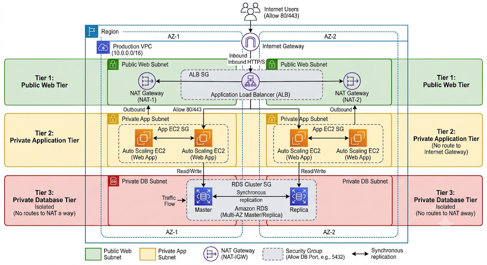
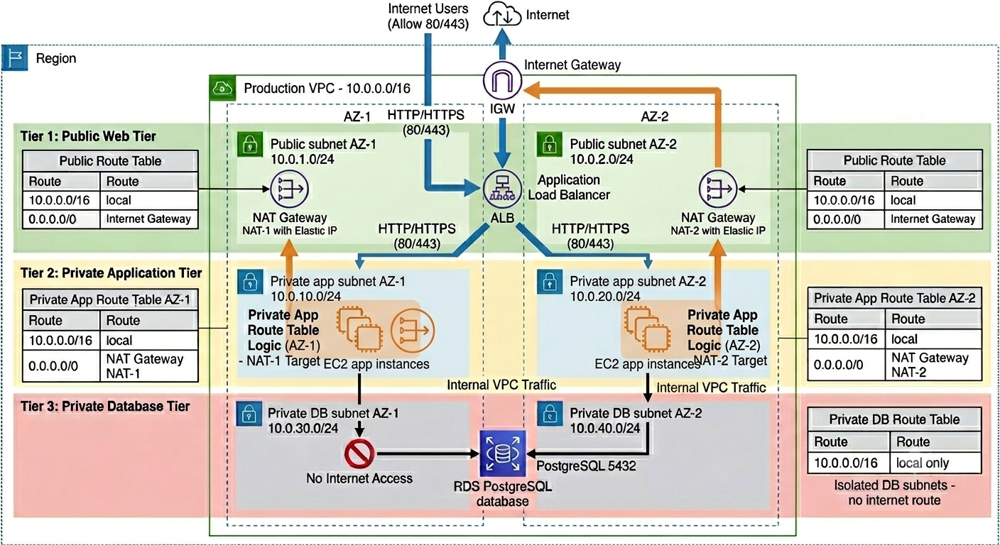

# Checkpoint 2: Production-Grade Three-Tier Architecture

## Project Overview

The primary objective of this checkpoint is to become familiar with Terraform modules and integrate the knowledge acquired throughout the previous stages of the course.

To achieve this, we will design and build a production-inspired three-tier architecture on AWS using Terraform. The exercise focuses on applying infrastructure-as-code best practices, reinforcing concepts such as modularization, dependency management, network segmentation, security boundaries, and reusable configurations.

The resulting architecture will host a web application that is publicly accessible while ensuring that both the application and database layers remain isolated from direct internet access. By the end of this checkpoint, you will have consolidated your understanding of Terraform by combining multiple AWS services into a cohesive and maintainable infrastructure deployment.

### Architectural Blueprint

The infrastructure is distributed across two Availability Zones (AZs) to simulate a highly available environment and demonstrate how modular Terraform configurations can be used to provision resilient cloud architectures.



---

## Infrastructure Requirements

The system is divided into three distinct logical tiers.

| Tier                | Components                                             | Accessibility                                                           |
| ------------------- | ------------------------------------------------------ | ----------------------------------------------------------------------- |
| Tier 1: Public      | Application Load Balancer (ALB), NAT Gateways          | Public access allowed through the Internet Gateway                      |
| Tier 2: Private App | Auto Scaling EC2 instances hosting the web application | No direct internet access; outbound traffic routed through NAT Gateways |
| Tier 3: Isolated DB | Amazon RDS PostgreSQL                                  | Completely isolated; accepts traffic only from the Application Tier     |

---

## Mandatory Directory Structure

To maintain modularity, domain separation, and ease of maintenance, the following directory structure must be strictly followed:

```text
.
├── modules/
│   ├── network/          # VPC, Subnets, IGW, NAT Gateways
│   ├── security/         # security_groups.tf, iam.tf
│   ├── alb_tier/         # Load Balancer, Target Groups, Listeners
│   ├── compute_tier/     # ASG, Launch Templates
│   └── database/         # RDS (PostgreSQL)
├── environments/
│   ├── dev/
│   │   ├── main.tf       # Root orchestration
│   │   └── terraform.tfvars
│   └── prod/             # Full production configuration
├── scripts/
│   └── install_app.sh    # Bootstrap: Nginx setup + /health endpoint
└── README.md             # Project-wide architecture overview
```

---

## Networking Foundation (CIDR Allocation)

The architecture uses a VPC CIDR block of `10.0.0.0/16`.

Subnets are distributed across two Availability Zones to provide fault tolerance and support Multi-AZ deployments.

| Tier   | Subnet Purpose          | Availability Zones | CIDR Blocks                    |
| ------ | ----------------------- | ------------------ | ------------------------------ |
| Public | ALB and NAT Gateways    | AZ1 / AZ2          | `10.0.1.0/24`, `10.0.2.0/24`   |
| App    | Web Application Servers | AZ1 / AZ2          | `10.0.10.0/24`, `10.0.20.0/24` |
| DB     | RDS Instances           | AZ1 / AZ2          | `10.0.30.0/24`, `10.0.40.0/24` |

### Route Table Design

The following diagram shows how public, private application, and isolated database subnets are associated with route tables across both Availability Zones.



### Networking Design Questions

Before implementing the network module, consider the following questions:

* Why does the VPC need an Internet Gateway?
* How is an Internet Gateway attached to the VPC?
* Why do public subnets need a route table with `0.0.0.0/0` pointing to the Internet Gateway?
* What is a NAT Gateway?
* Why should NAT Gateways be placed in public subnets?
* Why do private application subnets route outbound internet traffic through a NAT Gateway instead of directly through an Internet Gateway?
* Why should isolated database subnets not have a route to the Internet Gateway or NAT Gateway?
* How many route tables are needed for this architecture?
* How do route table associations connect public, application, and database subnets to the correct route tables?
* What outputs should the network module expose for other modules such as security, ALB, compute, and database?

---

## Technical Constraints and Design Rules

### Security Chaining

Security groups must never rely on hard-coded IP addresses.

Instead, each tier must reference the Security Group ID of the preceding tier.

| Security Group | Allowed Source | Allowed Ports            |
| -------------- | -------------- | ------------------------ |
| `sg_alb`       | `0.0.0.0/0`    | `80`, `443`              |
| `sg_app`       | `sg_alb`       | Application traffic only |
| `sg_db`        | `sg_app`       | PostgreSQL (`5432`)      |

### Compute Layer

The compute tier must adhere to the following requirements:

* Use `aws_launch_template`.
* Use `aws_autoscaling_group`.
* Do not use legacy Launch Configurations.

### Access Control

Remote administrative access must follow these requirements:

* Bastion Hosts are prohibited.
* AWS Systems Manager Session Manager must be used.
* EC2 instances must attach an IAM Role containing the following managed policy:

```text
AmazonSSMManagedInstanceCore
```

### Bootstrap and Health Checks

Application instances must initialize automatically using user data.

Requirements include:

* Execute `scripts/install_app.sh` during instance startup.
* Install and configure Nginx.
* Expose a `/health` endpoint.
* Return HTTP `200 OK` from the `/health` endpoint.
* Configure the ALB Target Group to use `/health` for health checks.

> **Scope Note:** This checkpoint uses an HTTP listener on port `80` only. HTTPS on port `443` is skipped for simplicity because it requires an ACM certificate and domain validation.

### Environment Parity

Development and Production environments must maintain consistent architecture while differing in scale and resiliency requirements.

| Environment | NAT Gateways   | Database Instance Type | Multi-AZ |
| ----------- | -------------- | ---------------------- | -------- |
| Dev         | 1              | `db.t3.micro`          | No       |
| Prod        | 2 (one per AZ) | `db.t3.small`          | Yes      |

For the development environment, the network still creates both Availability Zones and all corresponding subnets so the layout remains consistent with production. However, to keep the lab simpler and reduce cost, dev provisions only one NAT Gateway. In that case, both private application subnets route outbound internet traffic through the NAT Gateway in the first public subnet.

---

## Dependency Logic

Terraform automatically builds the dependency graph through resource references.

The root orchestration must maintain the following logical flow:

```text
network
    ↓
security
    ↓
alb_tier
compute_tier
database
```

This sequencing ensures that foundational infrastructure components are provisioned before dependent services.

---

## Definition of Done

The implementation is considered complete when all of the following criteria are satisfied.

### Modularization

* No hard-coded values.
* All configurable values are exposed through `variables.tf`.
* Modules remain self-contained and reusable.

### Documentation

* Every module contains a `README.md`.
* Each module README includes:

  * Inputs table.
  * Outputs table.
  * Module usage examples where applicable.

### Tagging

All AWS resources must include the following tags:

| Tag           | Value                        |
| ------------- | ---------------------------- |
| `Name`        | Resource-specific identifier |
| `Environment` | Deployment environment       |
| `Project`     | Project name                 |
| `ManagedBy`   | `Terraform`                  |

### State Management

* Local Terraform state is acceptable for this checkpoint.
* Migration to remote state using S3 and DynamoDB will be implemented in a later phase.

---

## Summary

This checkpoint establishes a production-grade AWS foundation emphasizing modularity, security, high availability, and operational best practices.

By separating responsibilities into dedicated Terraform modules and enforcing strict security boundaries between tiers, the resulting infrastructure provides a scalable and maintainable platform suitable for future enhancements and production workloads.
